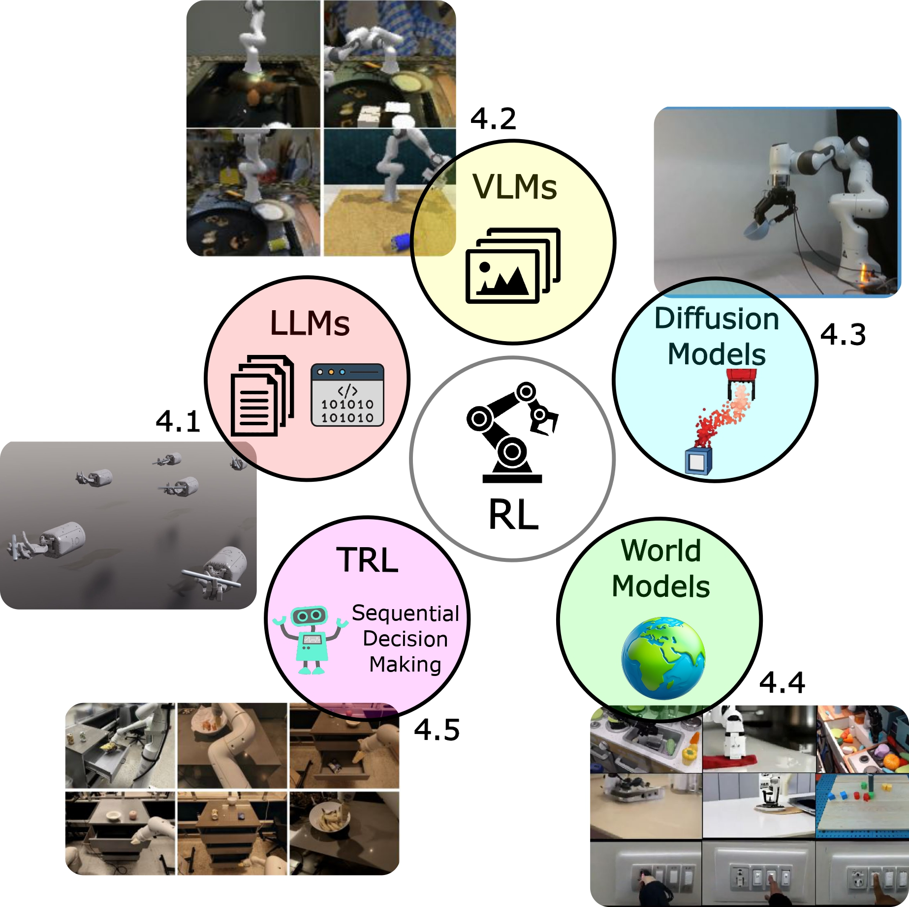
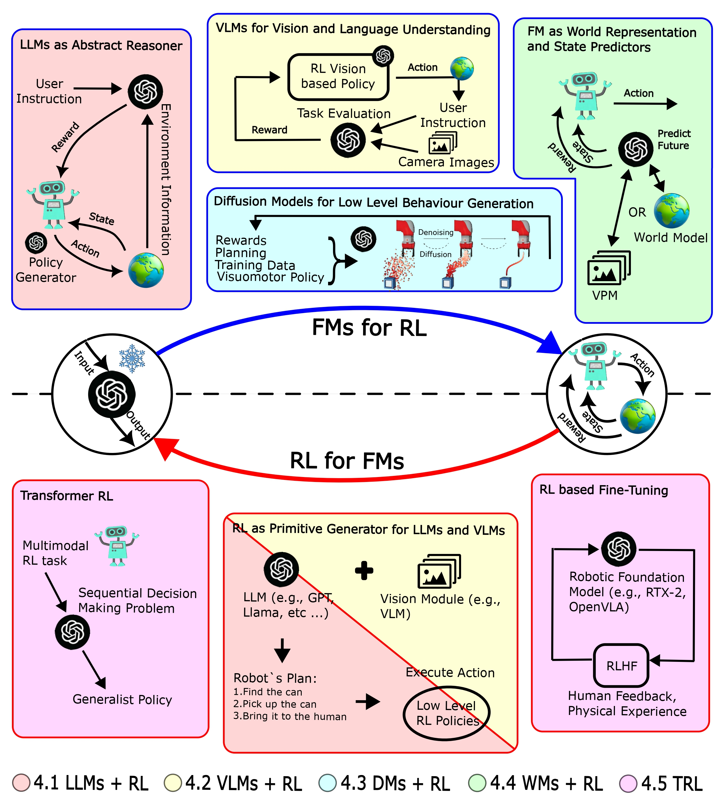
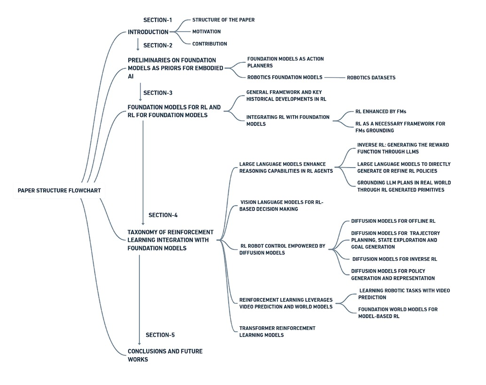

# Robotics-RL-FMs-Integration
This repository contains a curated list of the papers classified in the survey titled ***"Integrating Reinforcement Learning with Foundation Models for Autonomous Robotics: Methods and Perspectives"***. We also provide five Excel files (one for each category) that offer detailed summaries of the analyses we performed using the paper's taxonomy. These summaries cover several features of the analyzed papers, such as `name of the framework`, `model used`, `code availability`, `dataset`, `type of application`, `simulation vs. real-world`, `crosscategories`, `experiment evaluation`, `year of publication`, `RL for FM vs. FM for RL`, and `short description`.

<div align="center">
 
</div>

## Abstract
Large pre-trained models, such as foundation models (FMs), despite their powerful abilities to understand complex patterns and generate sophisticated outputs, often struggle with adapting to specific tasks. Reinforcement learning (RL), which allows agents to learn through interaction and feedback, presents a compelling solution. Integrating RL empowers foundation models to achieve desired outcomes and excel at specific tasks. Simultaneously, RL itself can be enhanced when coupled with the reasoning and generalization capabilities of FMs. The synergy between foundation models and RL is revolutionizing many fields, robotics is among them. Foundation models, rich in knowledge and generalization capabilities, provide robots with a wealth of information, while RL enables them to learn and adapt through real-world interaction. This survey paper offers a comprehensive exploration of this exciting intersection, examining how these paradigms can be integrated to push the boundaries of robotic intelligence. We analyze the use of foundation models as action planners, the development of robotics-specific foundation models, and the mutual benefits of combining foundation models with RL. We also present a taxonomy of integration approaches, including large language models, vision-language models, diffusion models, and transformer-based RL models. Finally, we delve into how RL can harness the world representations learned from foundation models to enhance robotic task execution. Through synthesizing current research and highlighting key challenges, this survey aims to spark future research and contribute to the development of more intelligent, adaptable, and capable robotic systems. To summarize the analysis conducted in this work, we also provide a continuously updated collection of papers based on our taxonomy.

<div align="center">
 
</div>

## Content of the paper

<div align="center">
 
</div>

## 1. Large Language Models Enhance Reasoning Capabilities in RL Agents
 ### 1.1 Inverse RL: generating the reward function through LLMs
  - Accelerating Reinforcement Learning of Robotic Manipulations via Feedback from Large Language Models [[paper]](https://arxiv.org/abs/2311.02379)
  - Augmenting Autotelic Agents with Large Language Models [[paper]](https://arxiv.org/abs/2305.12487)
  - Eureka: Human-Level Reward Design via Coding Large Language Models [[paper]](https://arxiv.org/abs/2310.12931)
  - FoMo Rewards: Can we cast foundation models as reward functions? [[paper]](https://arxiv.org/abs/2312.03881)
  - Guiding Pretraining in Reinforcement Learning with Large Language Models [[paper]](https://arxiv.org/abs/2302.06692)
  - Intrinsic Language-Guided Exploration for Complex Long-Horizon Robotic Manipulation Tasks [[paper]](https://arxiv.org/abs/2309.16347)
  - Language as a Cognitive Tool to Imagine Goals in Curiosity-Driven Exploration [[paper]](https://arxiv.org/abs/2002.09253)
  - Language to Rewards for Robotic Skill Synthesis [[paper]](https://arxiv.org/abs/2306.08647)
  - Learning Language-Conditioned Robot Behavior from Offline Data and Crowd-Sourced Annotation [[paper]](https://arxiv.org/abs/2109.01115)
  - Self-Refined Large Language Model as Automated Reward Function Designer for Deep Reinforcement Learning in Robotics [[paper]](https://arxiv.org/abs/2309.06687)
  - Text2Reward: Reward Shaping with Language Models for Reinforcement Learning [[paper]](https://arxiv.org/abs/2309.11489)
  - Utilizing Large Language Models for Robot Skill Reward Shaping in Reinforcement Learning [[paper]](https://link.springer.com/chapter/10.1007/978-981-96-0783-9_1)
  - DrEureka: Language Model Guided Sim-To-Real Transfer [[paper]](https://eureka-research.github.io/dr-eureka/)
 ### 1.2 Large language models to directly generate or refine RL policies
  - Bootstrap Your Own Skills: Learning to Solve New Tasks with Large Language Model Guidance [[paper]](https://arxiv.org/abs/2310.10021)
  - Grounding Large Language Models in Interactive Environments with Online Reinforcement Learning [[paper]](https://arxiv.org/abs/2302.02662)
  - Language Instructed Reinforcement Learning for Human-AI Coordination [[paper]](https://arxiv.org/abs/2304.07297)
  - Retrieval-Augmented Hierarchical in-Context Reinforcement Learning and Hindsight Modular Reflections for Task Planning with LLMs [[paper]](https://arxiv.org/abs/2408.06520)
 ### 1.3 Grounding LLM plans in real world through RL generated primitives
  - Do As I Can, Not As I Say: Grounding Language in Robotic Affordances [[paper]](https://arxiv.org/abs/2204.01691)
  - Grounded Decoding: Guiding Text Generation with Grounded Models for Embodied Agents [[paper]](https://arxiv.org/abs/2303.00855)
  - Plan-Seq-Learn: Language Model Guided RL for Solving Long Horizon Robotics Tasks [[paper]](https://arxiv.org/abs/2405.01534)
  - Prompt, Plan, Perform: LLM-based Humanoid Control via Quantized Imitation Learning [[paper]](https://arxiv.org/abs/2309.11359)
  - LLM Augmented Hierarchical Agents [[paper]](https://arxiv.org/abs/2311.05596)
## 2. Vision Language Models for RL-Based Decision Making
  - Can Foundation Models Perform Zero-Shot Task Specification For Robot Manipulation? [[paper]](https://arxiv.org/abs/2204.11134)
  - Code as Reward: Empowering Reinforcement Learning with VLMs [[paper]](https://arxiv.org/abs/2402.04764)
  - Foundation Models in Robotics: Applications, Challenges, and the Future [[paper]](https://arxiv.org/abs/2312.07843)
  - Language Reward Modulation for Pretraining Reinforcement Learning [[paper]](https://arxiv.org/abs/2308.12270)
  - LIV: Language-Image Representations and Rewards for Robotic Control [[paper]](https://arxiv.org/abs/2306.00958)
  - RL-VLM-F: Reinforcement Learning from Vision Language Foundation Model Feedback [[paper]](https://arxiv.org/abs/2402.03681)
  - RoboCLIP: One Demonstration is Enough to Learn Robot Policies [[paper]](https://arxiv.org/pdf/2310.07899)
  - Robot Fine-Tuning Made Easy: Pre-Training Rewards and Policies for Autonomous Real-World Reinforcement Learning [[paper]](https://arxiv.org/abs/2310.15145)
  - Towards A Unified Agent with Foundation Models [[paper]](https://arxiv.org/abs/2307.09668)
  - Vision-Language Models are Zero-Shot Reward Models for Reinforcement Learning [[paper]](https://arxiv.org/abs/2310.12921)
  - Vision-Language Models as a Source of Rewards [[paper]](https://arxiv.org/abs/2312.09187)
  - Vision-Language Models Provide Promptable Representations for Reinforcement Learning [[paper]](https://arxiv.org/abs/2402.02651)
  - Zero-Shot Reward Specification via Grounded Natural Language [[paper]](https://openreview.net/forum?id=zRb7IWkTZAU)
  - ExploRLLM: Guiding Exploration in Reinforcement Learning with Large Language Models [[paper]](https://arxiv.org/abs/2403.09583)
  - Affordance-Guided Reinforcement Learning via Visual Prompting [[paper]](https://arxiv.org/abs/2407.10341v1)
## 3. RL Robot Control Empowered by Diffusion Models
 ### 3.1 Diffusion models for offline RL
  - Contrastive Energy Prediction for Exact Energy-Guided Diffusion Sampling in Offline Reinforcement Learning [[paper]](https://arxiv.org/abs/2304.12824)
  - Efficient Diffusion Policies for Offline Reinforcement Learning [[paper]](https://arxiv.org/abs/2305.20081)
  - Fighting Uncertainty with Gradients: Offline Reinforcement Learning via Diffusion Score Matching [[paper]](https://arxiv.org/abs/2306.14079)
  - IDQL: Implicit Q-Learning as an Actor-Critic Method with Diffusion Policies [[paper]](https://arxiv.org/abs/2304.10573)
  - Instructed Diffuser with Temporal Condition Guidance for Offline Reinforcement Learning [[paper]](https://arxiv.org/abs/2306.04875)
  - Learning a Diffusion Model Policy from Rewards via Q-Score Matching [[paper]](https://arxiv.org/abs/2312.11752)
  - Learning to Reach Goals via Diffusion [[paper]](https://arxiv.org/abs/2310.02505)
  - MADIFF: Offline Multi-agent Learning with Diffusion Models [[paper]](https://arxiv.org/abs/2305.17330)
  - MetaDiffuser: Diffusion Model as Conditional Planner for Offline Meta-RL [[paper]](https://arxiv.org/abs/2305.19923)
  - Offline Reinforcement Learning via High-Fidelity Generative Behavior Modeling [[paper]](https://arxiv.org/abs/2209.14548)
  - Reasoning with Latent Diffusion in Offline Reinforcement Learning [[paper]](https://arxiv.org/abs/2309.06599)
 ### 3.2 Diffusion models for planning
  - AdaptDiffuser: Diffusion Models as Adaptive Self-evolving Planners [[paper]](https://arxiv.org/abs/2302.01877)
  - Adaptive Online Replanning with Diffusion Models [[paper]](https://arxiv.org/abs/2310.09629)
  - Cold Diffusion on the Replay Buffer: Learning to Plan from Known Good States [[paper]](https://arxiv.org/abs/2310.13914)
  - Diffusion Model is an Effective Planner and Data Synthesizer for Multi-Task Reinforcement Learning [[paper]](https://arxiv.org/abs/2305.18459)
  - DiPPeR: Diffusion-based 2D Path Planner applied on Legged Robots [[paper]](https://arxiv.org/abs/2310.07842)
  - EDGI: Equivariant Diffusion for Planning with Embodied Agents [[paper]](https://arxiv.org/abs/2303.12410)
  - Hierarchical Diffuser: Simple Hierarchical Planning with Diffusion [[paper]](https://arxiv.org/abs/2401.02644)
  - Language Control Diffusion: Efficiently Scaling Through Space, Time, and Tasks [[paper]](https://arxiv.org/abs/2210.15629)
  - Planning with Diffusion for Flexible Behavior Synthesis [[paper]](https://arxiv.org/abs/2205.09991)
  - Refining Diffusion Planner for Reliable Behavior Synthesis by Automatic Detection of Infeasible Plans [[paper]](https://arxiv.org/abs/2310.19427)
  - SafeDiffuser: Safe Planning with Diffusion Probabilistic Models via Control Barrier Functions [[paper]](https://arxiv.org/abs/2306.00148)
  - SSD: Sub-trajectory Stitching with Diffusion Model for Goal-Conditioned Offline Reinforcement Learning [[paper]](https://arxiv.org/abs/2402.07226)
 ### 3.3 Diffusion models for inverse RL
  - Extracting Reward Functions from Diffusion Models [[paper]](https://arxiv.org/abs/2306.01804)
  - Reward-Directed Conditional Diffusion Models for Directed Generation and Representation Learning [[paper]](https://arxiv.org/abs/2307.07055)
  - Diffused Value Function: Value Function Estimation using Conditional Diffusion Models for Control [[paper]](https://arxiv.org/abs/2306.07290)
  - Diffusion Reward: Learning Rewards via Conditional Video Diffusion [[paper]](https://arxiv.org/abs/2312.14134)
  - Can Pre-Trained Text-to-Image Models Generate Visual Goals for Reinforcement Learning? [[paper]](https://arxiv.org/abs/2307.07837)
 ### 3.4 Diffusion models for policy generation and representation
  - Consistency Models as a Rich and Efficient Policy Class for Reinforcement Learning [[paper]](https://arxiv.org/abs/2309.16984)
  - Diffusion Policies as an Expressive Policy Class for Offline Reinforcement Learning [[paper]](https://arxiv.org/abs/2208.06193)
  - Beyond Conservatism: Diffusion Policies in Offline Multi-agent Reinforcement Learning [[paper]](https://arxiv.org/abs/2307.01472)
  - Diffusion Policy: Visuomotor Policy Learning via Action Diffusion [[paper]](https://arxiv.org/abs/2303.04137)
  - Generating Behaviorally Diverse Policies with Latent Diffusion Models [[paper]](https://arxiv.org/abs/2305.18738)
  - Hierarchical Diffusion for Offline Decision Making [[paper]](https://proceedings.mlr.press/v202/li23ad.html)
  - Is Conditional Generative Modeling All You Need for Decision-Making? [[paper]](https://arxiv.org/abs/2211.15657)
  - Policy Representation via Diffusion Probability Model for Reinforcement Learning [[paper]](https://arxiv.org/abs/2305.13122)
  - Offline Skill Diffusion for Robust Cross-Domain Policy Learning [[paper]](https://arxiv.org/abs/2403.00225)
  - Score Regularized Policy Optimization through Diffusion Behavior for Efficient Offline Reinforcement Learning [[paper]](https://arxiv.org/abs/2310.07297)
  - Policy-Guided Diffusion [[paper]](https://arxiv.org/abs/2404.06356)
  - Pre-trained Text-to-Image Diffusion Models Are Versatile Representation Learners for Control [[paper]](https://arxiv.org/pdf/2405.05852)
  - Diffusion Policy Policy Optimization [[paper]](https://arxiv.org/abs/2409.00588)
## 4. Reinforcement Learning Leverages Video Prediction and World Models
 ### 4.1 Learning robotic tasks with video prediction
  - Foundation Reinforcement Learning (FRL) [[paper]](https://arxiv.org/abs/2310.02635)
  - Learning Generalizable Robotic Reward Functions from 'In-The-Wild' Human Videos [[paper]](https://arxiv.org/abs/2103.16817)
  - Video prediction models as rewards for reinforcement learning [[paper]](https://arxiv.org/abs/2305.14343)
  - Learning reward functions for robotic manipulation by observing humans [[paper]](https://arxiv.org/abs/2211.09019)
  - Vip: Towards universal visual reward and representation via value-implicit pre-training [[paper]](https://arxiv.org/abs/2210.00030)
  - Learning Universal Policies via Text-Guided Video Generation [[paper]](https://arxiv.org/abs/2302.00111)
  - Robotic offline rl from internet videos via value-function pre-training [[paper]](https://arxiv.org/abs/2309.13041)
  - Where are we in the search for an artificial visual cortex for embodied intelligence? [[paper]](https://arxiv.org/abs/2303.18240)
 ### 4.2 Foundation world models for model-based RL
  - Masked World Models for Visual Control [[paper]](https://arxiv.org/abs/2206.14244)
  - Multi-View Masked World Models for Visual Robotic Manipulation [[paper]](https://arxiv.org/abs/2302.02408)
  - Do Embodied Agents Dream of Pixelated Sheep: Embodied Decision Making using Language Guided World Modelling [[paper]](https://arxiv.org/abs/2301.12050)
  - EnvGen: Generating and Adapting Environments via LLMs for Training Embodied Agents [[paper]](https://arxiv.org/abs/2403.12014)
  - UniSim: Learning Interactive Real-World Simulators [[paper]](https://arxiv.org/abs/2310.06114)
  - RoboGen: Towards Unleashing Infinite Data for Automated Robot Learning via Generative Simulation [[paper]](https://arxiv.org/abs/2311.01455)
  - Recurrent World Models Facilitate Policy Evolution [[paper]](https://papers.nips.cc/paper_files/paper/2018/hash/2de5d16682c3c35007e4e92982f1a2ba-Abstract.html)
  - GenSim: Generating Robotic Simulation Tasks via Large Language Models [[paper]](https://arxiv.org/abs/2310.01361)
  - GenRL: Multimodal Foundation World Models for Generalist Embodied Agents [[paper]](https://arxiv.org/abs/2406.18043)
  - iVideoGPT: Interactive VideoGPTs are Scalable World Models [[paper]](https://arxiv.org/abs/2405.15223)
  - Zero-shot Safety Prediction for Autonomous Robots with Foundation World Models [[paper]](https://arxiv.org/abs/2404.00462)
  - Genie: Generative Interactive Environments [[paper]](https://arxiv.org/abs/2402.15391)
## 5. Transformer Reinforcement Learning Models
  - Multi-agent reinforcement learning is a sequence modeling problem [[paper]](https://arxiv.org/abs/2205.14953)
  - Hyper-decision transformer for efficient online policy adaptation [[paper]](https://arxiv.org/abs/2304.08487)
  - Prompt-tuning decision transformer with preference ranking [[paper]](https://arxiv.org/abs/2305.09648)
  - Pre-training for robots: Offline rl enables learning new tasks from a handful of trials [[paper]](https://arxiv.org/abs/2210.05178)
  - Think before you act: Unified policy for interleaving language reasoning with actions [[paper]](https://arxiv.org/abs/2304.11063)
  - Online Foundation Model Selection in Robotics [[paper]](https://arxiv.org/abs/2402.08570)
  - Fine-tuning Reinforcement Learning Models is Secretly a Forgetting Mitigation Problem [[paper]](https://arxiv.org/abs/2402.02868)
  - A generalist agent [[paper]](https://arxiv.org/abs/2205.06175)
  - HarmoDT: Harmony Multi-Task Decision Transformer for Offline Reinforcement Learning [[paper]](https://arxiv.org/abs/2405.18080)
  - Transformers are adaptable task planners [[paper]](https://arxiv.org/abs/2207.02442)
  - Pact: Perception-action causal transformer for autoregressive robotics pre-training [[paper]](https://arxiv.org/abs/2209.11133)
  - Latte: Language trajectory transformer [[paper]](https://arxiv.org/abs/2208.02918)
  - Q-transformer: Scalable offline reinforcement learning via autoregressive q-functions [[paper]](https://arxiv.org/abs/2309.10150)
  - Anymorph: Learning transferable polices by inferring agent morphology [[paper]](https://arxiv.org/abs/2206.12279)
## Citation

If you find our project useful, please cite our paper:

```
@article{moroncelli2024integrating,
  title={Integrating Reinforcement Learning with Foundation Models for Autonomous Robotics: Methods and Perspectives},
  author={Moroncelli, Angelo and Soni, Vishal and Shahid, Asad Ali and Maccarini, Marco and Forgione, Marco and Piga, Dario and Spahiu, Blerina and Roveda, Loris},
  journal={arXiv preprint arXiv:2410.16411},
  year={2024}
}
```
