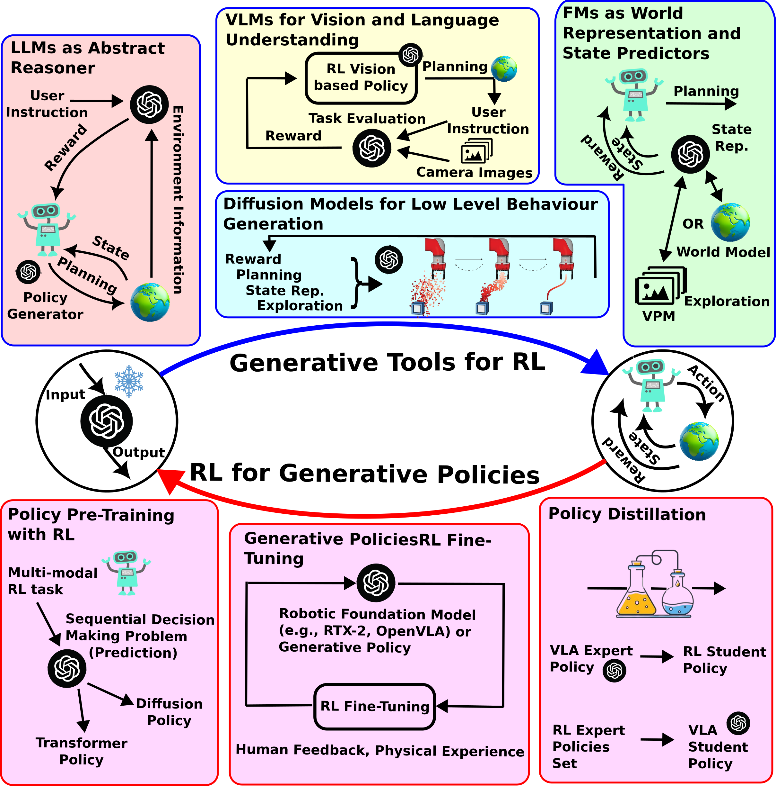
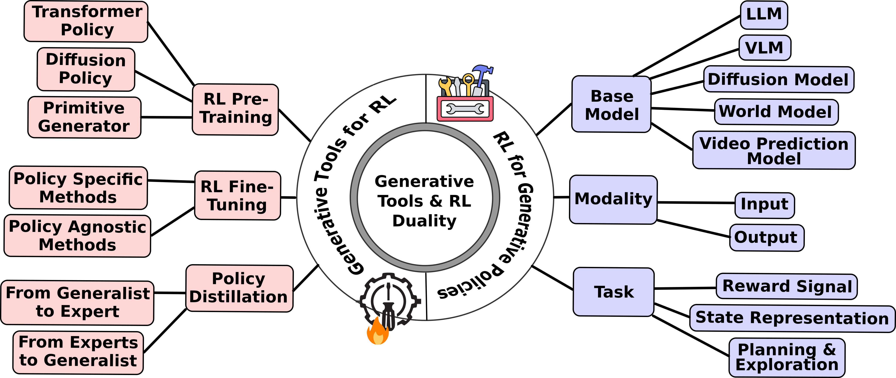
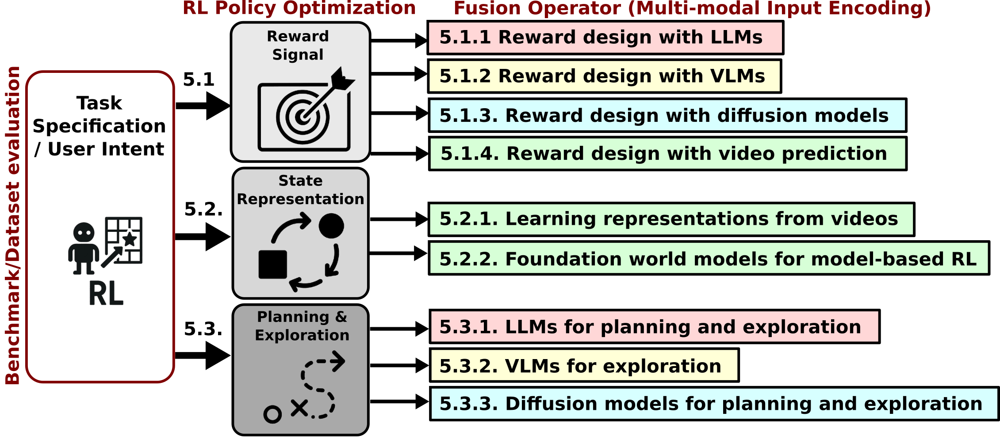

# Awesome Papers Merging Generative AI and Reinforcement Learning in Robotics

[](https://awesome.re)

This repository contains a curated list of papers and resources related to the survey titled "**The Duality of Generative AI and Reinforcement Learning in Robotics: A Review**".

The paper explores the synergy between modern generative AI tools (transformer- and diffusion-based models) and Reinforcement Learning (RL) for advancing robotic intelligence and physical grounding.

We also provide five Excel files (one for each category) that offer detailed summaries of the analyses we performed using the paper's taxonomy. These summaries cover several features of the analyzed papers, such as `name of the framework`, `model used`, `code availability`, `dataset`, `type of application`, `simulation vs. real-world`, `crosscategories`, `experiment evaluation`, `year of publication`, and `short description`.

## Abstract

Our review paper examines the integration of generative AI models, specifically transformer- and diffusion-based models, with reinforcement learning (RL) to advance robotic physical grounding, ensuring robotic actions are based on environment interactions rather than purely computational inference. Our primary focus is on the interplay between generative AI and RL for robotics downstream tasks. Specifically, we investigate: (1) The role of generative AI tools (large language models, vision-language models, diffusion models, and world models) as priors in RL-based robotics. (2) The integration of different input-output modalities from pre-trained modules into the RL training loop. (3) How RL can train generative models for robotic policies, similar to its applications in language models. We then propose a new taxonomy based on our findings. Lastly, we identify key trends and open challenges, accounting for model scalability, generalizability, and grounding. Moreover, we devise architectural trade-offs in RL fine-tuning strategies for generative policies. We also reflect on issues inherent to generative black-box policies, such as safety concerns and failure modes, which could be addressed through learning-based approaches like RL. Actually, our findings suggest that learning-based control techniques will play a crucial role in grounding generative policies within real-world constraints in general.

*(Keywords: Robotics, Generative AI, Foundation model, Reinforcement learning, Physical grounding)*

## Research Trends

To visualize the evolution of research in this domain, the following figure illustrates the trends in the integration of generative AI and reinforcement learning for robotics.

<div align="center">
  
  <br>
  <em>Figure 1: Trends in generative AI and RL integration for robotics.</em>
</div>

## The Duality of Generative AI and Reinforcement Learning

The relationship between Reinforcement Learning and state-of-the-art generative models is a central theme of our review.This interplay is a duality with mutual benefits: generative models enhance RL capabilities, and RL helps ground generative policies in real-world applications. This symbiotic relationship is depicted in the following figure.

<br>

<div align="center">

  <br>
  <em>Figure 2: Duality between RL and generative AI models in robotics.</em>
</div>

## Taxonomy

<div align="center">
 
  <br>
  <em>Figure 3: Taxonomy.</em>
</div>


## Generative Tools for RL
**Generative Tools for RL** explores how various architectures from modern generative AI can be integrated into the RL training loop. We analyze prior work on leveraging generative and foundation models to enhance robotics, focusing on architectures based on Transformer or Diffusion backbones. "As tools" highlights that pre-trained foundation models (like LLMs) are not being retrained end-to-end with the RL agent, but are instead leveraged in a modular way — as plug-and-play components that provide capabilities (such as understanding or generating specific modalities) that the RL agent can use during training or decision making.

<div align="center">

  <br>
  <em>Figure 4: Generative AI tools for RL.</em>
</div>

For Generative Tools for RL, we categorize papers based on their underlying model architecture, which we refer to as the **Base Model**; the input and output modalities, referred to as **Modality**; and finally, the aim of the RL process, which we call the **Task**.

### Base Model

The Base Model section classifies the papers according to their backbone architecture, briefly describes their features, and summarizes key aspects in tables. These
aspects are important when selecting a tool for the RL tasks. See the Excel tables for a detailed classification:

1. [Large Language Models](Large_Language_Models_for_RL_Table.xlsx)
2. [Vision Language Models](Vision_Language_Models_for_RL_Table.xlsx)
3. [Diffusion models](Diffusion_Models_for_RL_Table.xlsx)
4. [World Models](World_Models_and_Video_Prediction_Models_for_RL_Table.xlsx)
5. [Video Prediction Models](World_Models_and_Video_Prediction_Models_for_RL_Table.xlsx)

### Modality

This section focuses on the classification of the five types of generative AI models used in RL with an emphasis on how their input/output modalities shape their role within RL frameworks. These modalities vary across models: LLMs process text; VLMs combine visual and textual data; diffusion models handle a range of low-level and sensory modalities; world models integrate multiple modalities and generate internal representations. In the following, we analyze how these modality choices translate into trade-offs between abstraction and grounding, diversity and specificity for RL tasks, and ease of integration with RL agents.

| Model Type         | Input Modality                            | Output Modality                        | Primary Role in RL                                                                      | Trade-off Focus                                          |
| :----------------- | :---------------------------------------- | :------------------------------------- | :-------------------------------------------------------------------------------------- | :------------------------------------------------------- |
| **LLMs** | Text                                      | Text                                   | **Abstract Reasoning:** Symbolic processing, task goals, reward signals, high-level objectives, task refinements. | High Abstraction, Less Grounding                         |
| **VLMs** | Visual + Text                             | Reasoning over Visuals                 | **Visual Feedback/Context:** Visual scene understanding, reasoning over visual inputs, bridging visual and textual context. | High Abstraction, Moderately Grounded                    |
| **Diffusion Models** | Low-level/Sensory Data                    | Low-level Control Actions              | **Fine-grained Control:** Policy learning, state generation, precise continuous control signals in action space. | High Grounding, Less Abstraction                         |
| **World Models** | Multi-modal (Visual, Text, Proprioceptive, etc.) | Multi-modal State Representations, Predictions | **Environment Dynamics & Planning:** Learning predictive models, rich multi-modal state representations, supporting model-based RL. | Fuses Abstraction & Grounding                            |

### Task
This section explores how generative AI models address key challenges in robotic RL, such as **sparse rewards, sample inefficiency, generalization, and goal specification**, by enhancing stages like **Reward Signal generation, State Representation, and Policy Learning.**

<div align="center">
 
  <br>
  <em>Figure 5: Generative models as information fusion operators across RL tasks.</em>
</div>

#### Reward Signal

##### 1.Learning reward functions with LLMs
 - Augmenting Autotelic Agents with Large Language Models [[paper]](https://arxiv.org/abs/2305.12487)
 - Intrinsic Language-Guided Exploration for Complex Long-Horizon Robotic Manipulation Tasks [[paper]](https://arxiv.org/abs/2309.16347)
 - FoMo Rewards: Can we cast foundation models as reward functions? [[paper]](https://arxiv.org/abs/2312.03881)
 - Learning Language-Conditioned Robot Behavior from Offline Data and Crowd-Sourced Annotation [[paper]](https://arxiv.org/abs/2109.01115)
 - RLingua: Improving Reinforcement Learning Sample Efficiency in Robotic Manipulations With Large Language Models [[paper]](https://rlingua.github.io/)
 - Game On: Towards Language Models as RL Experimenters [[paper]](https://arxiv.org/pdf/2409.03402)
 - DrEureka: Language Model Guided Sim-To-Real Transfer [[paper]](https://eureka-research.github.io/dr-eureka/)
 - Text2Reward: Reward Shaping with Language Models for Reinforcement Learning [[paper]](https://arxiv.org/abs/2309.11489)
 - Eureka: Human-Level Reward Design via Coding Large Language Models [[paper]](https://arxiv.org/abs/2310.12931)
 - Self-Refined Large Language Model as Automated Reward Function Designer for Deep Reinforcement Learning in Robotics [[paper]](https://arxiv.org/abs/2309.06687)
 - Language to Rewards for Robotic Skill Synthesis [[paper]](https://arxiv.org/abs/2306.08647)
 - Guiding Pretraining in Reinforcement Learning with Large Language Models [[paper]](https://arxiv.org/abs/2302.06692)
 - (2025)! Towards Autonomous Reinforcement Learning for Real-World Robotic Manipulation With Large Language Models [[paper]](https://ieeexplore.ieee.org/abstract/document/11080043)
 - (2025)! LLM-Guided Reinforcement Learning: Addressing Training Bottlenecks through Policy Modulation [[paper]](https://arxiv.org/abs/2505.20671)
 - (2025)! LLM Coach: Reward Shaping for Reinforcement Learning-Based Navigation Agent [[paper]](https://ieeexplore.ieee.org/abstract/document/11051677)
 - (2025)! Reward Evolution with Graph-of-Thoughts: A Bi-Level Language Model Framework for Reinforcement Learning [[paper]](https://arxiv.org/abs/2509.16136)
 - (2025)! Embodied-R: Collaborative Framework for Activating Embodied Spatial Reasoning in Foundation Models via Reinforcement Learning [[paper]](https://arxiv.org/pdf/2504.12680)
 - (2025)! Grounding Multimodal LLMs to Embodied Agents that Ask for Help with Reinforcement Learning [[paper]](https://arxiv.org/abs/2504.00907)

##### 2.VLMs for reward learning
- Learning transferable visual models from natural language supervision [[paper]](https://doi.org/10.48550/arXiv.2103.00020)
- Zero-shot text-to-image generation [[paper]](https://doi.org/10.48550/arXiv.2102.12092)
- Vision-Language Models as a Source of Rewards [[paper]](https://arxiv.org/abs/2312.09187)
- Vision language models are zero-shot reward models for reinforcement learning[[paper]](https://doi.org/10.48550/arXiv.2310.12921)
- Language Reward Modulation for Pretraining Reinforcement Learning [[paper]](https://arxiv.org/abs/2308.12270)
- RoboCLIP: One Demonstration is Enough to Learn Robot Policies [[paper]](https://arxiv.org/pdf/2310.07899)
- Robot Fine-Tuning Made Easy: Pre-Training Rewards and Policies for Autonomous Real-World Reinforcement Learning [[paper]](https://arxiv.org/abs/2310.15145)
- Affordance-Guided Reinforcement Learning via Visual Prompting [[paper]](https://arxiv.org/abs/2407.10341v1)
- LIV: Language-Image Representations and Rewards for Robotic Control [[paper]](https://arxiv.org/abs/2306.00958)
- Vision-Language Models are Zero-Shot Reward Models for Reinforcement Learning [[paper]](https://arxiv.org/abs/2310.12921)
- Code as Reward: Empowering Reinforcement Learning with VLMs [[paper]](https://openreview.net/pdf?id=6P88DMUDvH)
- Zero-Shot Reward Specification via Grounded Natural Language [[paper]](https://openreview.net/forum?id=zRb7IWkTZAU)
- The dark side of rich rewards: Understanding and mitigating noise in vlm rewards [[paper]](https://doi.org/10.48550/arXiv.2409.15922)
- (2025)! A Vision-Language-Action-Critic Model for Robotic Real-World Reinforcement Learning [[paper]](https://arxiv.org/abs/2509.15937)
- (2025)! Policy Learning from Large Vision-Language Model Feedback without Reward Modeling [[paper]](https://arxiv.org/abs/2507.23391)
- (2025)! VARP: Reinforcement Learning from Vision-Language Model Feedback with Agent Regularized Preferences [[paper]](https://arxiv.org/abs/2503.13817)

##### 3.Reward learning with diffusion models
- Diffusion Reward: Learning Rewards via Conditional Video Diffusion [[paper]](https://arxiv.org/abs/2312.14134)
- Extracting Reward Functions from Diffusion Models [[paper]](https://arxiv.org/abs/2306.01804)
- Diffused Value Function: Value Function Estimation using Conditional Diffusion Models for Control [[paper]](https://arxiv.org/abs/2306.07290)
- Reward-Directed Conditional Diffusion Models for Directed Generation and Representation Learning [[paper]](https://arxiv.org/abs/2307.07055)
- Learning a Diffusion Model Policy from Rewards via Q-Score Matching [[paper]](https://arxiv.org/abs/2312.11752)
- (2025)! TeViR: Text-to-Video Reward with Diffusion Models for Efficient Reinforcement Learning [[paper]](https://arxiv.org/abs/2505.19769)
- (2025)! GenFlowRL: Shaping Rewards with Generative Object-Centric Flow in Visual Reinforcement Learning [[paper]](https://arxiv.org/abs/2508.11049)

##### 4.Learning rewards from video prediction
- Learning Generalizable Robotic Reward Functions from 'In-The-Wild' Human Videos [[paper]](https://arxiv.org/abs/2103.16817)
- Video prediction models as rewards for reinforcement learning [[paper]](https://arxiv.org/abs/2305.14343)
- Learning reward functions for robotic manipulation by observing humans [[paper]](https://arxiv.org/abs/2211.09019)
- Vip: Towards universal visual reward and representation via value-implicit pre-training [[paper]](https://arxiv.org/abs/2210.00030)
- (2025)! VideoWorld: Exploring Knowledge Learning from Unlabeled Videos [[paper]](https://openaccess.thecvf.com/content/CVPR2025/html/Ren_VideoWorld_Exploring_Knowledge_Learning_from_Unlabeled_Videos_CVPR_2025_paper.html)
- (2025)! LuciBot: Automated Robot Policy Learning from Generated Videos [[paper]](https://arxiv.org/abs/2503.09871)

#### State Representation

##### 1.Learning representations from videos
- FoundationReinforcement Learning: towards Embodied Generalist Agents with Foundation Prior Assistance [[paper]](https://doi.org/10.48550/arXiv.2310.02635)
- Learning Universal Policies via Text-Guided Video Generation [[paper]](https://arxiv.org/abs/2302.00111)
- Robotic offline rl from internet videos via value-function pre-training [[paper]](https://arxiv.org/abs/2309.13041)
- Where are we in the search for an artificial visual cortex for embodied intelligence? [[paper]](https://arxiv.org/abs/2303.18240)
- Foundation Reinforcement Learning (FRL) [[paper]](https://arxiv.org/abs/2310.02635)
- (2025)! Video Generators are Robot Policies [[paper]](https://arxiv.org/abs/2508.00795)
- (2025)! Pre-Trained Video Generative Models as World Simulators [[paper]](https://arxiv.org/abs/2502.07825)

##### 2.Foundation world models for model-based RL
- Daydreamer: World models for physical robot learning [[paper]](https://arxiv.org/abs/2206.14176)
- Recurrent World Models Facilitate Policy Evolution [[paper]](https://papers.nips.cc/paper_files/paper/2018/hash/2de5d16682c3c35007e4e92982f1a2ba-Abstract.html)
- Masked World Models for Visual Control [[paper]](https://arxiv.org/abs/2206.14244)
- Multi-View Masked World Models for Visual Robotic Manipulation [[paper]](https://arxiv.org/abs/2302.02408)
- RoboGen: Towards Unleashing Infinite Data for Automated Robot Learning via Generative Simulation [[paper]](https://arxiv.org/abs/2311.01455)
- iVideoGPT: Interactive VideoGPTs are Scalable World Models [[paper]](https://arxiv.org/abs/2405.15223)
- Zero-shot Safety Prediction for Autonomous Robots with Foundation World Models [[paper]](https://arxiv.org/abs/2404.00462)
- Genie: Generative Interactive Environments [[paper]](https://arxiv.org/abs/2402.15391)
- On the role of forgetting in fine-tuning reinforcement learning models [[paper]](https://doi.org/10.48550/arXiv.2402.02868)
- Improving Transformer World Models for Data-Efficient RL [[paper]](https://arxiv.org/pdf/2502.01591)
- Investigating online rl in world models [[paper]](https://openreview.net/pdf?id=xw4jtToUrf)
- RoboDreamer: Learning Compositional World Models for Robot Imagination [[paper]](https://arxiv.org/pdf/2404.12377)
- R-AIF: Solving sparse-reward robotic tasks from pixels with active inference and world models [[paper]](https://arxiv.org/pdf/2409.14216)
- Learning View-invariant World Models for Visual Robotic Manipulation [[paper]](https://openreview.net/forum?id=vJwjWyt4Ed)
- MoDem-V2: Visuo-Motor World Models for Real-World Robot Manipulation [[paper]](https://ieeexplore.ieee.org/abstract/document/10611121)
- Advancing Humanoid Locomotion: Mastering Challenging Terrains with Denoising World Model Learning [[paper]](https://arxiv.org/pdf/2408.14472)
- A generalizable egovision multimodal world model for fine-grained ego-motion, object dynamics, and scene composition control [[paper]](https://doi.org/10.48550/arXiv.2412.11198)
- World models for physical robot learning [[paper]](https://arxiv.org/abs/2206.14176)
- GenRL: Multimodal Foundation World Models for Generalist Embodied Agents [[paper]](https://arxiv.org/abs/2406.18043)
- EnvGen: Generating and Adapting Environments via LLMs for Training Embodied Agents [[paper]](https://arxiv.org/abs/2403.12014)
- Do Embodied Agents Dream of Pixelated Sheep: Embodied Decision Making using Language Guided World Modelling [[paper]](https://arxiv.org/abs/2301.12050)
- GenSim: Generating Robotic Simulation Tasks via Large Language Models [[paper]](https://arxiv.org/abs/2310.01361)
- UniSim: Learning Interactive Real-World Simulators [[paper]](https://arxiv.org/abs/2310.06114)
- (2025)! RoboHorizon: An LLM-Assisted Multi-View World Model for Long-Horizon Robotic Manipulation [[paper]](https://arxiv.org/abs/2501.06605)
- (2025)! Learning Primitive Embodied World Models: Towards Scalable Robotic Learning [[paper]](https://openreview.net/forum?id=W0AY49wWrb)
- (2025)! GWM: Towards Scalable Gaussian World Models for Robotic Manipulation [[paper]](https://openaccess.thecvf.com/content/ICCV2025/html/Lu_GWM_Towards_Scalable_Gaussian_World_Models_for_Robotic_Manipulation_ICCV_2025_paper.html)
- (2025)! Robotic World Model: A Neural Network Simulator for Robust Policy Optimization in Robotics [[paper]](https://arxiv.org/abs/2501.10100)
- (2025)! FlowDreamer: A RGB-D World Model with Flow-based Motion Representations for Robot Manipulation [[paper]](https://arxiv.org/abs/2505.10075)
- (2025)! Accelerating Model-Based Reinforcement Learning with State-Space World Models [[paper]](https://arxiv.org/abs/2502.20168)
- (2025)! Offline Robotic World Model: Learning Robotic Policies without a Physics Simulator [[paper]](https://arxiv.org/abs/2504.16680)
- (2025)! Efficient Reinforcement Learning by Guiding Generalist World Models with Non-Curated Data [[paper]](https://arxiv.org/abs/2502.19544)

####   Planning & Exploration

##### 1.LLMs for exploration
- Grounding Large Language Models in Interactive Environments with Online Reinforcement Learning [[paper]](https://arxiv.org/abs/2302.02662)
- Language as a Cognitive Tool to Imagine Goals in Curiosity-Driven Exploration [[paper]](https://arxiv.org/abs/2002.09253)
- Bootstrap Your Own Skills: Learning to Solve New Tasks with Large Language Model Guidance [[paper]](https://arxiv.org/abs/2310.10021)
- ExploRLLM: Guiding Exploration in Reinforcement Learning with Large Language Models [[paper]](https://arxiv.org/pdf/2403.09583)
- (2025)! LaGR-SEQ: Language-guided reinforcement learning with sample-efficient querying [[paper]](https://link.springer.com/article/10.1007/s00521-025-11156-y)
- (2025)! Language-Conditioned Offline RL for Multi-Robot Navigation [[paper]](https://ieeexplore.ieee.org/abstract/document/11127288)
- (2025)! LLM-Explorer: A Plug-in Reinforcement Learning Policy Exploration Enhancement Driven by Large Language Models [[paper]](https://arxiv.org/abs/2505.15293)

##### 2.VLMs for exploration
- RL-VLM-F: Reinforcement Learning from Vision Language Foundation Model Feedback [[paper]](https://arxiv.org/abs/2402.03681)
- Vision-Language Models Provide Promptable Representations for Reinforcement Learning [[paper]](https://arxiv.org/abs/2402.02651)
- Can Foundation Models Perform Zero-Shot Task Specification For Robot Manipulation? [[paper]](https://arxiv.org/abs/2204.11134)
- Towards A Unified Agent with Foundation Models [[paper]](https://arxiv.org/abs/2307.09668)
- (2025)! Preference VLM: Leveraging VLMs for Scalable Preference-Based Reinforcement Learning [[paper]](https://arxiv.org/abs/2502.01616)
- (2025)! Teaching RL Agents to Act Better: VLM as Action Advisor for Online Reinforcement Learning [[paper]](https://arxiv.org/abs/2509.21126)
- (2025)! VLM Q-Learning: Aligning Vision-Language Models for Interactive Decision-Making [[paper]](https://arxiv.org/abs/2505.03181)
- (2025)! ERA: Transforming VLMs into Embodied Agents via Embodied Prior Learning and Online Reinforcement Learning [[paper]](https://arxiv.org/abs/2510.12693)

##### 3.LLMs for planning
- Do As I Can, Not As I Say: Grounding Language in Robotic Affordances [[paper]](https://arxiv.org/abs/2204.01691)
- Grounded Decoding: Guiding Text Generation with Grounded Models for Embodied Agents [[paper]](https://arxiv.org/abs/2303.00855)
- Plan-Seq-Learn: Language Model Guided RL for Solving Long Horizon Robotics Tasks [[paper]](https://arxiv.org/abs/2405.01534)
- Utilizing Large Language Models for Robot Skill Reward Shaping in Reinforcement Learning [[paper]](https://link.springer.com/chapter/10.1007/978-981-96-0783-9_1)
- Language Instructed Reinforcement Learning for Human-AI Coordination [[paper]](https://arxiv.org/abs/2304.07297)
- Retrieval-Augmented Hierarchical in-Context Reinforcement Learning and Hindsight Modular Reflections for Task Planning with LLMs [[paper]](https://arxiv.org/abs/2408.06520)
- LLM Augmented Hierarchical Agents [[paper]](https://arxiv.org/abs/2311.05596)
- Real-World Offline Reinforcement Learning from Vision Language Model Feedback [[paper]](https://arxiv.org/pdf/2411.05273)
- Preference VLM: Leveraging VLMs for Scalable Preference-Based Reinforcement Learning [[paper]](https://arxiv.org/pdf/2502.01616)
- Motiongpt: Finetuned llms are general-purpose motion generators [[paper]](https://doi.org/10.48550/arXiv.2306.10900)
- Prompt, Plan, Perform: LLM-based Humanoid Control via Quantized Imitation Learning [[paper]](https://arxiv.org/abs/2309.11359)
- Grounding llms for robot task planning using closed-loop state feedback [[paper]](https://doi.org/10.48550/arXiv.2402.08546)
- Accelerating Reinforcement Learning of Robotic Manipulations via Feedback from Large Language Models [[paper]](https://arxiv.org/abs/2311.02379)
- Socratic models: Composing zero-shot multimodal reasoning with language [[paper]](https://doi.org/10.48550/arXiv.2204.00598)
- Minigpt-4: Enhancing visionlanguage understanding with advanced large language models [[paper]](https://doi.org/10.48550/arXiv.2304.10592)
- (2025)! Collision- and Reachability-Aware Multi-Robot Control with Grounded LLM Planners [[paper]](https://arxiv.org/abs/2505.20573)
- (2025)! Multi-Agent Fuzzy Reinforcement Learning With LLM for Cooperative Navigation of Endovascular Robotics [[paper]](https://ieeexplore.ieee.org/abstract/document/11078928)
- (2025)! Evaluating a Hybrid LLM Q-Learning/DQN Framework for Adaptive Obstacle Avoidance in Embedded Robotics [[paper]](https://www.mdpi.com/2673-2688/6/6/115)

##### 4.Diffusion models for planning and exploration
- Generative adversarial imitation learning [[paper]](https://doi.org/10.48550/arXiv.1606.03476)
- Deterministic sampling-based motion planning: Optimality, complexity, and performance [[paper]](https://doi.org/10.1177/0278364917714338)
- Planning with Diffusion for Flexible Behavior Synthesis [[paper]](https://arxiv.org/abs/2205.09991)
- EDGI: Equivariant Diffusion for Planning with Embodied Agents [[paper]](https://arxiv.org/abs/2303.12410)
- Cold Diffusion on the Replay Buffer: Learning to Plan from Known Good States [[paper]](https://arxiv.org/abs/2310.13914)
- Refining Diffusion Planner for Reliable Behavior Synthesis by Automatic Detection of Infeasible Plans [[paper]](https://arxiv.org/abs/2310.19427)
- Hierarchical Diffuser: Simple Hierarchical Planning with Diffusion [[paper]](https://arxiv.org/abs/2401.02644)
- Stitching sub-trajectories with conditional diffusion model for goal-conditioned offline rl [[paper]](https://doi.org/10.1609/aaai.v38i12.29215)
- Language Control Diffusion: Efficiently Scaling Through Space, Time, and Tasks [[paper]](https://arxiv.org/abs/2210.15629)
-  SSD: Sub-trajectory Stitching with Diffusion Model for Goal-Conditioned Offline Reinforcement Learning [[paper]](https://arxiv.org/abs/2402.07226)
- DiffSkill: Improving Reinforcement Learning through diffusion-based skill denoiser for robotic manipulation [[paper]](https://www.sciencedirect.com/science/article/abs/pii/S0950705124008244)
- Can Pre-Trained Text-to-Image Models Generate Visual Goals for Reinforcement Learning? [[paper]](https://arxiv.org/abs/2307.07837)
- Scaling rectified flow transformers for high-resolution image synthesis [[paper]](https://doi.org/10.48550/arXiv.2403.03206)
- IDQL: Implicit Q-Learning as an Actor-Critic Method with Diffusion Policies [[paper]](https://arxiv.org/abs/2304.10573)
- Learning to Reach Goals via Diffusion [[paper]](https://arxiv.org/abs/2310.02505)
- Offline Reinforcement Learning via High-Fidelity Generative Behavior Modeling [[paper]](https://arxiv.org/abs/2209.14548)
- MADIFF: Offline Multi-agent Learning with Diffusion Models [[paper]](https://arxiv.org/abs/2305.17330)
- Diffusion Policy: Visuomotor Policy Learning via Action Diffusion [[paper]](https://arxiv.org/abs/2303.04137)
- Diffuseloco: Real-time legged locomotion control with diffusion from offline datasets[[paper]](https://doi.org/10.48550/arXiv.2404.19264)
- Goal masked diffusion policies for navigation and exploration [[paper]](https://doi.org/10.1109/ICRA57147.2024.10610665)
- Diffusion Model is an Effective Planner and Data Synthesizer for Multi-Task Reinforcement Learning [[paper]](https://arxiv.org/abs/2305.18459)
- Adaptive Online Replanning with Diffusion Models [[paper]](https://arxiv.org/abs/2310.09629)
- DiPPeR: Diffusion-based 2D Path Planner applied on Legged Robots [[paper]](https://arxiv.org/abs/2310.07842)
- SafeDiffuser: Safe Planning with Diffusion Probabilistic Models via Control Barrier Functions [[paper]](https://arxiv.org/abs/2306.00148)
- AdaptDiffuser: Diffusion Models as Adaptive Self-evolving Planners [[paper]](https://arxiv.org/abs/2302.01877)
- Flow q-learning [[paper]](https://doi.org/10.48550/arXiv.2502.02538)
- High-resolution image synthesis with latent diffusion models [[paper]](https://doi.org/10.1109/CVPR52688.2022.01042)
- Contrastive Energy Prediction for Exact Energy-Guided Diffusion Sampling in Offline Reinforcement Learning [[paper]](https://arxiv.org/abs/2304.12824)
- Efficient Diffusion Policies for Offline Reinforcement Learning [[paper]](https://arxiv.org/abs/2305.20081)
- Fighting Uncertainty with Gradients: Offline Reinforcement Learning via Diffusion Score Matching [[paper]](https://arxiv.org/abs/2306.14079)
- Robust policy learning via offline skill diffusion [[paper]](https://doi.org/10.48550/arXiv.2403.00225)
- Reasoning with Latent Diffusion in Offline Reinforcement Learning [[paper]](https://arxiv.org/abs/2309.06599)
- Instructed Diffuser with Temporal Condition Guidance for Offline Reinforcement Learning [[paper]](https://arxiv.org/abs/2306.04875)
- MetaDiffuser: Diffusion Model as Conditional Planner for Offline Meta-RL [[paper]](https://arxiv.org/abs/2305.19923)
- (2025)! COLSON: Controllable Learning-Based Social Navigation via Diffusion-Based Reinforcement Learning [[paper]](https://arxiv.org/abs/2503.13934)
- (2025)! Offline Reinforcement Learning with Discrete Diffusion Skills [[paper]](https://arxiv.org/abs/2503.20176)
- (2025)! DASP: Hierarchical Offline Reinforcement Learning via Diffusion Autodecoder and Skill Primitive [[paper]](https://ieeexplore.ieee.org/abstract/document/10816163)
- (2025)! Garment Diffusion Models for Robot-Assisted Dressing [[paper]](https://ieeexplore.ieee.org/abstract/document/10803021)
- (2025)! Enhancing Exploration With Diffusion Policies in Hybrid Off-Policy RL: Application to Non-Prehensile Manipulation [[paper]](https://ieeexplore.ieee.org/abstract/document/10978025)
- (2025)! Offline Adaptation of Quadruped Locomotion Using Diffusion Models [[paper]](https://ieeexplore.ieee.org/abstract/document/11128726)
- (2025)! DiffusionRL: Efficient Training of Diffusion Policies for Robotic Grasping Using RL-Adapted Large-Scale Datasets [[paper]](https://arxiv.org/abs/2505.18876)
- (2025)! Motion Planning Diffusion: Learning and Adapting Robot Motion Planning With Diffusion Models [[paper]](https://ieeexplore.ieee.org/abstract/document/11097366)
- (2025)! GenPO: Generative Diffusion Models Meet On-Policy Reinforcement Learning [[paper]](https://arxiv.org/abs/2505.18763)
- (2025)! Chaos-Augmented Reinforcement Learning With Diffusion Models for Robust Legged Robot Locomotion [[paper]](https://ieeexplore.ieee.org/abstract/document/11218266)
- (2025)! Generalizable Offline Multiobjective Reinforcement Learning via Preference-Conditioned Diffuser [[paper]](https://ieeexplore.ieee.org/abstract/document/11201894)
- (2025)! World4RL: Diffusion World Models for Policy Refinement with Reinforcement Learning for Robotic Manipulation [[paper]](https://arxiv.org/abs/2509.19080)
- (2025)! DreamControl: Human-Inspired Whole-Body Humanoid Control for Scene Interaction via Guided Diffusion [[paper]](https://arxiv.org/abs/2509.14353)
- (2025)! Continual Diffuser (CoD): Mastering Continual Offline RL With Experience Rehearsal [[paper]](https://ieeexplore.ieee.org/abstract/document/11165204)
- (2025)! PegasusFlow: Parallel Rolling-Denoising Score Sampling for Robot Diffusion Planner Flow Matching [[paper]](https://arxiv.org/abs/2509.08435)

## RL for Generative Policies 
The second primary dimension of our taxonomy examines RL methods used to train generative models, offering a complementary perspective to Generative AI Tools for RL. Here, we analyze works that employ RL-based approaches to pre-train, fine-tune, or distill generative policies—where reinforcement learning is used directly to optimize models for action generation. We organize our discussion along three secondary dimensions, which we refer to as: (i) RL-Based Pre-Training, (ii) RL-Based Fine-Tuning, and (iii) Policy Distillation

### RL Pre-Training 

#### 1.Transformer Policy
  - Multi-agent reinforcement learning is a sequence modeling problem [[paper]](https://arxiv.org/abs/2205.14953)
  - Hyper-decision transformer for efficient online policy adaptation [[paper]](https://arxiv.org/abs/2304.08487)
  - Prompt-tuning decision transformer with preference ranking [[paper]](https://arxiv.org/abs/2305.09648)
  - Pre-training for robots: Offline rl enables learning new tasks from a handful of trials [[paper]](https://arxiv.org/abs/2210.05178)
  - Think before you act: Unified policy for interleaving language reasoning with actions [[paper]](https://arxiv.org/abs/2304.11063)
  - Online Foundation Model Selection in Robotics [[paper]](https://arxiv.org/abs/2402.08570)
  - Fine-tuning Reinforcement Learning Models is Secretly a Forgetting Mitigation Problem [[paper]](https://arxiv.org/abs/2402.02868)
  - A generalist agent [[paper]](https://arxiv.org/abs/2205.06175)
  - HarmoDT: Harmony Multi-Task Decision Transformer for Offline Reinforcement Learning [[paper]](https://arxiv.org/abs/2405.18080)
  - Transformers are adaptable task planners [[paper]](https://arxiv.org/abs/2207.02442)
  - Pact: Perception-action causal transformer for autoregressive robotics pre-training [[paper]](https://arxiv.org/abs/2209.11133)
  - Latte: Language trajectory transformer [[paper]](https://arxiv.org/abs/2208.02918)
  - Q-transformer: Scalable offline reinforcement learning via autoregressive q-functions [[paper]](https://arxiv.org/abs/2309.10150)
  - Anymorph: Learning transferable polices by inferring agent morphology [[paper]](https://arxiv.org/abs/2206.12279)
  - (2025)! AgentGym-RL: Training LLM Agents for Long-Horizon Decision Making through Multi-Turn Reinforcement Learning [[paper]](https://arxiv.org/abs/2509.08755)
  - (2025)! ManipLVM-R1: Reinforcement Learning for Reasoning in Embodied Manipulation with Large Vision-Language Models [[paper]](https://arxiv.org/abs/2505.16517)
  - (2025)! Enhancing Vision-Language Model Training with Reinforcement Learning in Synthetic Worlds for Real-World Success [[paper]](https://arxiv.org/abs/2508.04280)
  - (2025)! MoRE: Unlocking Scalability in Reinforcement Learning for Quadruped Vision-Language-Action Models [[paper]](https://arxiv.org/abs/2503.08007)

#### 2.Diffusion Policy
  - Consistency Models as a Rich and Efficient Policy Class for Reinforcement Learning [[paper]](https://arxiv.org/abs/2309.16984)
  - Diffusion Policies as an Expressive Policy Class for Offline Reinforcement Learning [[paper]](https://arxiv.org/abs/2208.06193)
  - Beyond Conservatism: Diffusion Policies in Offline Multi-agent Reinforcement Learning [[paper]](https://arxiv.org/abs/2307.01472)
  - Diffusion Policy: Visuomotor Policy Learning via Action Diffusion [[paper]](https://arxiv.org/abs/2303.04137)
  - Generating Behaviorally Diverse Policies with Latent Diffusion Models [[paper]](https://arxiv.org/abs/2305.18738)
  - Hierarchical Diffusion for Offline Decision Making [[paper]](https://proceedings.mlr.press/v202/li23ad.html)
  - Is Conditional Generative Modeling All You Need for Decision-Making? [[paper]](https://arxiv.org/abs/2211.15657)
  - Policy Representation via Diffusion Probability Model for Reinforcement Learning [[paper]](https://arxiv.org/abs/2305.13122)
  - Offline Skill Diffusion for Robust Cross-Domain Policy Learning [[paper]](https://arxiv.org/abs/2403.00225)
  - Score Regularized Policy Optimization through Diffusion Behavior for Efficient Offline Reinforcement Learning [[paper]](https://arxiv.org/abs/2310.07297)
  - Policy-Guided Diffusion [[paper]](https://arxiv.org/abs/2404.06356)
  - Pre-trained Text-to-Image Diffusion Models Are Versatile Representation Learners for Control [[paper]](https://arxiv.org/pdf/2405.05852)
  - IDQL: Implicit Q-Learning as an Actor-Critic Method with Diffusion Policies [[paper]](https://arxiv.org/abs/2304.10573)
  - Revisiting generative policies: A simpler reinforcement learning algorithmic perspective [[paper]](https://arxiv.org/abs/2412.01245)
  - Policy Representation via Diffusion Probability Model for Reinforcement Learning [[paper]](https://arxiv.org/pdf/2305.13122)
  - Diffusion policies as an expressive policy class for offline reinforcement learning [[paper]](https://arxiv.org/pdf/2208.06193)
  - Diffusion Policies for Out-of-Distribution Generalization in Offline Reinforcement Learning [[paper]](https://ieeexplore.ieee.org/abstract/document/10423845)
  - (2025)! Non-differentiable Reward Optimization for Diffusion-based Autonomous Motion Planning [[paper]](https://arxiv.org/abs/2507.12977)
  - (2025)! D3P: Dynamic Denoising Diffusion Policy via Reinforcement Learning [[paper]](https://arxiv.org/abs/2508.06804)

### Generative Policy RL Fine-Tuning
  - Policy Agnostic RL Fine-Tuning Multiple Policy Classes with Actor-Critic RL [[paper]](https://policyagnosticrl.github.io/#:~:text=We%20introduce%20Policy-2.Agnostic%20RL,and%20transformer-based%20autoregressive%20policies.)
  - Diffusion Policy Policy Optimization [[paper]](https://arxiv.org/abs/2409.00588)
  - FLaRe: Achieving Masterful and Adaptive Robot Policies with Large-Scale Reinforcement Learning Fine-Tuning [[paper]](https://robot-flare.github.io/)
  - Fine-Tuning Large Vision-Language Models as Decision-Making Agents via Reinforcement Learning [[paper]](https://arxiv.org/abs/2405.10292)
  - (2025)! FDPP: Fine-tune Diffusion Policy with Human Preference [[paper]](https://arxiv.org/html/2501.08259v1)
  - (2025)! Improving Vision-Language-Action Model with Online Reinforcement Learning [[paper]](https://arxiv.org/pdf/2501.16664)
  - (2025)! From Mystery to Mastery: Failure Diagnosis for Improving Manipulation Policies [[paper]](https://somsagar07.github.io/RoboMD/)
  - (2025)! VLA-RL: Towards Masterful and General Robotic Manipulation with Scalable Reinforcement Learning [[paper]](https://arxiv.org/abs/2505.18719)
  - (2025)! SimpleVLA-RL: Scaling VLA Training via Reinforcement Learning [[paper]](https://arxiv.org/abs/2509.09674)
  - (2025)! Emergent World Representations in OpenVLA [[paper]](https://arxiv.org/abs/2509.24559)
  - (2025)! Integrating Diffusion-based Multi-task Learning with Online Reinforcement Learning for Robust Quadruped Robot Control [[paper]](https://arxiv.org/abs/2507.05674)
  - (2025)! RobotxR1: Enabling Embodied Robotic Intelligence on Large Language Models through Closed-Loop Reinforcement Learning [[paper]](https://arxiv.org/abs/2505.03238)
  - (2025)! Reinforced Embodied Planning with Verifiable Reward for Real-World Robotic Manipulation [[paper]](https://arxiv.org/abs/2509.25852)
  - (2025)! IRL-VLA: Training an Vision-Language-Action Policy via Reward World Model [[paper]](https://arxiv.org/abs/2508.06571)
  - (2025)! ConRFT: A Reinforced Fine-tuning Method for VLA Models via Consistency Policy [[paper]](https://arxiv.org/abs/2502.05450)
  - (2025)! VLA-RFT: Vision-Language-Action Reinforcement Fine-tuning with Verified Rewards in World Simulators [[paper]](https://arxiv.org/abs/2510.00406)
  - (2025)! ReinboT: Amplifying Robot Visual-Language Manipulation with Reinforcement Learning [[paper]](https://openreview.net/forum?id=Mzz4BhdIFb)
  - (2025)! What Can RL Bring to VLA Generalization? An Empirical Study [[paper]](https://arxiv.org/abs/2505.19789)
  - (2025)! Interactive Post-Training for Vision-Language-Action Models [[paper]](https://arxiv.org/abs/2505.17016)
  - (2025)! RLinf-VLA: A Unified and Efficient Framework for VLA+RL Training [[paper]](https://arxiv.org/abs/2510.06710)
  - (2025)! Steering Your Diffusion Policy with Latent Space Reinforcement Learning [[paper]](https://arxiv.org/abs/2506.15799)
  - (2025)! Fine-tuning Diffusion Policies with Backpropagation Through Diffusion Timesteps [[paper]](https://arxiv.org/abs/2505.10482)

### Policy Distillation
- Rldg: Robotic generalist policy distillation via reinforcement learning [[paper]](https://doi.org/10.48550/arXiv.2412.09858)
- Evaluating real-world robot manipulation policies in simulation [[paper]](https://doi.org/10.48550/arXiv.2405.05941)
- (2025)! Refined policy distillation: From vla generalists to rl experts [[paper]](https://doi.org/10.48550/arXiv.2503.05833)
- (2025)! VLMs-Guided Representation Distillation for Efficient Vision-Based Reinforcement Learning [[paper]](https://openaccess.thecvf.com/content/CVPR2025/html/Xu_VLMs-Guided_Representation_Distillation_for_Efficient_Vision-Based_Reinforcement_Learning_CVPR_2025_paper.html)
- (2025)! RLRC: Reinforcement Learning-based Recovery for Compressed Vision-Language-Action Models [[paper]](https://arxiv.org/abs/2506.17639)

### Policy Safety (new!)
- (2025)! SafeVLA: Towards Safety Alignment of VisionLanguage-Action Model via Constrained Learning [[paper]](https://arxiv.org/pdf/2503.03480)
- (2025)! Collision- and Reachability-Aware Multi-Robot Control with Grounded LLM Planners [[paper]](https://arxiv.org/abs/2505.20573)
  
## Citation

If you find our project useful, please cite our paper:

```
@article{moroncelli2024integrating,
  title={Integrating Reinforcement Learning with Foundation Models for Autonomous Robotics: Methods and Perspectives},
  author={Moroncelli, Angelo and Soni, Vishal and Shahid, Asad Ali and Maccarini, Marco and Forgione, Marco and Piga, Dario and Spahiu, Blerina and Roveda, Loris},
  journal={arXiv preprint arXiv:2410.16411},
  year={2024}
}
```
