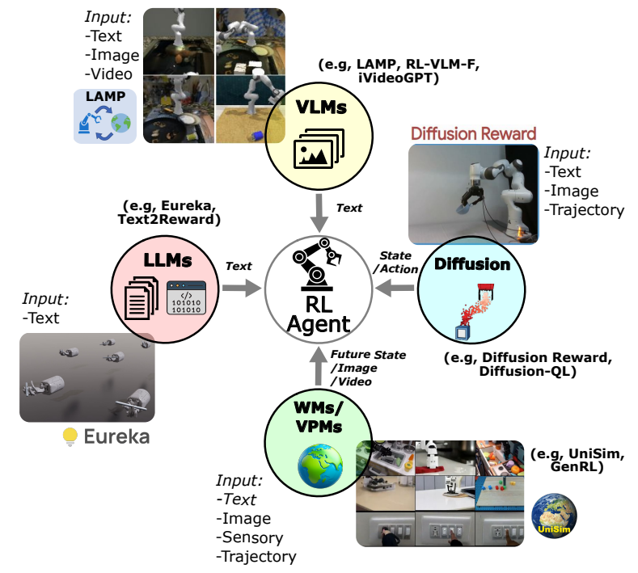
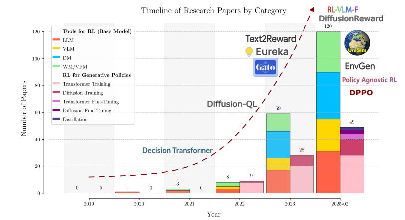
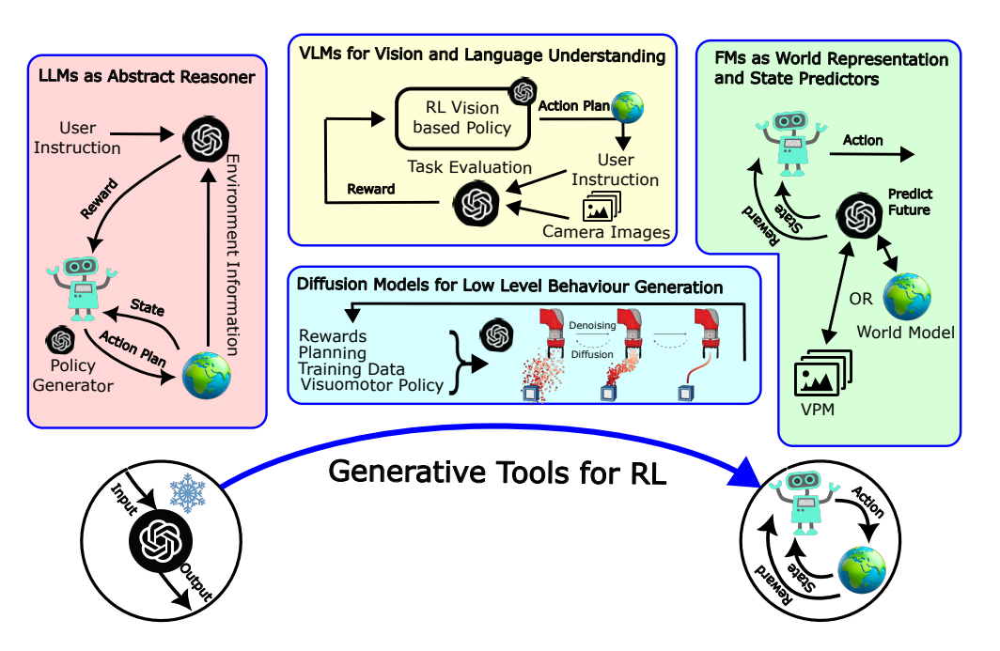
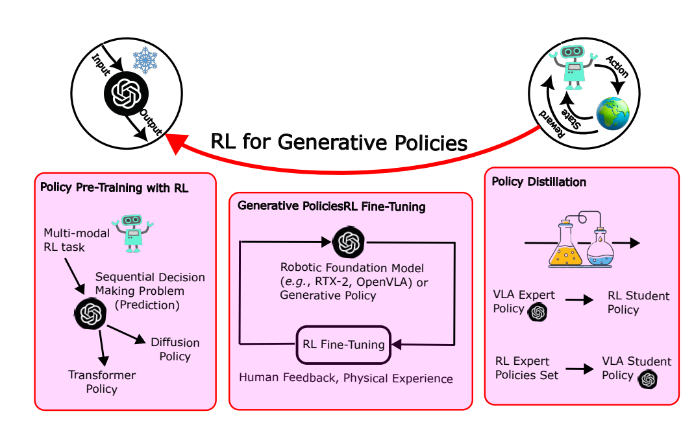

# Review on Integration of Transformer- and Diffusion-based Models with Reinforcement Learning for Robotics

This repository contains a curated list of papers and resources related to the survey titled "**Review on Integration of Transformer- and Diffusion-based Models with Reinforcement Learning for Robotics**". The paper explores the synergy between modern generative AI tools (transformer- and diffusion-based models) and Reinforcement Learning (RL) for advancing robotic intelligence and physical grounding.

We also provide five Excel files (one for each category) that offer detailed summaries of the analyses we performed using the paper's taxonomy. These summaries cover several features of the analyzed papers, such as `name of the framework`, `model used`, `code availability`, `dataset`, `type of application`, `simulation vs. real-world`, `crosscategories`, `experiment evaluation`, `year of publication`, and `short description`.A curated collection of relevant research papers is maintained on our GitHub repository, serving as a resource for ongoing research and development in this field. 

<div align="center">

</div>

## Research Trends

To visualize the evolution of research in this domain, the following figure illustrates the trends in the integration of generative AI and reinforcement learning for robotics.

<div align="center">
  
  <br>
  <em>Figure 1: Trends in generative AI and reinforcement learning integration for robotic reasoning. The figure illustrates the number of papers published each year integrating both generative AI and RL in robotics, categorized by the type of model employed.</em>
</div>


## Abstract

Our review paper examines the integration of generative AI models, specifically transformer- and diffusion-based models, with reinforcement learning (RL) to advance robotic physical grounding, ensuring robotic actions are based on environment interactions rather than purely computational inference. Our primary focus is on the interplay between generative AI and RL for robotics downstream tasks. Specifically, we investigate: (1) The role of generative AI tools (large language models, vision-language models, diffusion models, and world models) as priors in RL-based robotics. (2) The integration of different input-output modalities from pre-trained modules into the RL training loop. (3) How RL can train generative models for robotic policies, similar to its applications in language models. We then propose a new taxonomy based on our findings. Lastly, we identify key trends and open challenges, accounting for model scalability, generalizability, and grounding. Moreover, we devise architectural trade-offs in RL fine-tuning strategies for generative policies. We also reflect on issues inherent to generative black-box policies, such as safety concerns and failure modes, which could be addressed through learning-based approaches like RL. Actually, our findings suggest that learning-based control techniques will play a crucial role in grounding generative policies within real-world constraints in general. A curated collection of relevant research papers is maintained on our GitHub repository, serving as a resource for ongoing research and development in this field.

*(Keywords: Robotics, Generative AI, Foundation model, Reinforcement learning, Physical grounding)*

### The Duality of Generative AI and Reinforcement Learning

The relationship between Reinforcement Learning (RL) and state-of-the-art generative models is a central theme of our review.This interplay is a duality with mutual benefits: generative models enhance RL capabilities, and RL helps ground generative policies in real-world applications.  This symbiotic relationship is depicted in the following figures.

<br>

| **(a) Generative AI Tools for RL** | **(b) RL for Generative Policies** |
| :---: | :---: |
|  |  |
| :---: | :---: |
| <em>In **Figure (a)**, we illustrate scenarios where various generative AI tools enhance RL capabilities. LLMs aid in symbolic reasoning for rewards or policy generation, VLMs augment these processes through scene understanding, while diffusion models contribute by working with low-level trajectories. Lastly, robot state estimation and prediction are informed by VPMs or world models.</em> | <em>The second dimension of our taxonomy, shown in **Figure (b)**, examines how RL methods are used to train generative models. This offers a complementary perspective to using generative AI as tools for RL. Here, we analyze works where RL is directly used to optimize models for generation, including Policy Pre-Training, RL Fine-Tuning, and Policy Distillation.</em> |

## Taxonomy

<div align="center">
 
</div>


## Generative Tools for RL
**Generative Tools for RL** explores how various architectures from modern generative AI can be integrated into the RL training loop. We analyze prior work on leveraging generative and foundation models to enhance robotics, focusing on architectures based on Transformer or Diffusion backbones. "As tools" highlights that pre-trained foundation models (like LLMs) are not being retrained end-to-end with the RL agent, but are instead leveraged in a modular way — as plug-and-play components that provide capabilities (such as understanding or generating specific modalities) that the RL agent can use during training or decision making.

For Generative Tools for RL, we categorize papers based on their underlying model architecture, which we refer to as the **Base Model**; the input and output modalities, referred to as **Modality**; and finally, the aim of the RL process, which we call the **Task**.

### Base Model

The Base Model section classifies the papers according to their backbone architecture, briefly describes their features, and summarizes key aspects in tables. These
aspects are important when selecting a tool for the RL tasks

#### 1.Large Language Models
- DrEureka: Language Model Guided Sim-To-Real Transfer [[paper]](https://eureka-research.github.io/dr-eureka/)
- Grounding llms for robot task planning using closed-loop state feedback [[paper]](https://doi.org/10.48550/arXiv.2402.08546)
- ExploRLLM: Guiding Exploration in Reinforcement Learning with Large Language Models [[paper]](https://arxiv.org/pdf/2403.09583)
-  Motiongpt: Finetuned llms are general-purpose motion generators [[paper]](https://doi.org/10.48550/arXiv.2306.10900)
-  Prompt, Plan, Perform: LLM-based Humanoid Control via Quantized Imitation Learning [[paper]](https://arxiv.org/abs/2309.11359)
- Survey on large language model-enhanced reinforcement learning: Concept, taxonomy, and methods [[paper]](https://doi.org/10.48550/arXiv.2404.00282)
- Foundation models in robotics: Applications, challenges, and the future [[paper]](https://doi.org/10.48550/arXiv.2312.07843)
- Accelerating Reinforcement Learning of Robotic Manipulations via Feedback from Large Language Models [[paper]](https://arxiv.org/abs/2311.02379)
- Socratic models: Composing zero-shot multimodal reasoning with language [[paper]](https://doi.org/10.48550/arXiv.2204.00598)
- Large language models for robotics: Opportunities, challenges,and perspectives [[paper]](https://doi.org/10.48550/arXiv.2401.04334)
- Minigpt-4: Enhancing visionlanguage understanding with advanced large language models [[paper]](https://doi.org/10.48550/arXiv.2304.10592)

#### 2.Vision Language Models
- RL-VLM-F: Reinforcement Learning from Vision Language Foundation Model Feedback [[paper]](https://arxiv.org/abs/2402.03681)
- Vision-Language Models Provide Promptable Representations for Reinforcement Learning [[paper]](https://arxiv.org/abs/2402.02651)
- Can Foundation Models Perform Zero-Shot Task Specification For Robot Manipulation? [[paper]](https://arxiv.org/abs/2204.11134)
- Code as Reward: Empowering Reinforcement Learning with VLMs [[paper]](https://openreview.net/pdf?id=6P88DMUDvH)
- LIV: Language-Image Representations and Rewards for Robotic Control [[paper]](https://arxiv.org/abs/2306.00958)
- Towards A Unified Agent with Foundation Models [[paper]](https://arxiv.org/abs/2307.09668)
- Zero-Shot Reward Specification via Grounded Natural Language [[paper]](https://openreview.net/forum?id=zRb7IWkTZAU)
- The dark side of rich rewards: Understanding and mitigating noise in vlm rewards [[paper]](https://doi.org/10.48550/arXiv.2409.15922)

#### 3.Diffusion models
- High-resolution image synthesis with latent diffusion models [[paper]](https://doi.org/10.1109/CVPR52688.2022.01042)
- Scaling rectified flow transformers for high-resolution image synthesis [[paper]](https://doi.org/10.48550/arXiv.2403.03206)
- Contrastive Energy Prediction for Exact Energy-Guided Diffusion Sampling in Offline Reinforcement Learning [[paper]](https://arxiv.org/abs/2304.12824)
- Efficient Diffusion Policies for Offline Reinforcement Learning [[paper]](https://arxiv.org/abs/2305.20081)
- Fighting Uncertainty with Gradients: Offline Reinforcement Learning via Diffusion Score Matching [[paper]](https://arxiv.org/abs/2306.14079)
- IDQL: Implicit Q-Learning as an Actor-Critic Method with Diffusion Policies [[paper]](https://arxiv.org/abs/2304.10573)
- Robust policy learning via offline skill diffusion [[paper]](https://doi.org/10.48550/arXiv.2403.00225)
- Reasoning with Latent Diffusion in Offline Reinforcement Learning [[paper]](https://arxiv.org/abs/2309.06599)
- Instructed Diffuser with Temporal Condition Guidance for Offline Reinforcement Learning [[paper]](https://arxiv.org/abs/2306.04875)
- Learning a Diffusion Model Policy from Rewards via Q-Score Matching [[paper]](https://arxiv.org/abs/2312.11752)
- Learning to Reach Goals via Diffusion [[paper]](https://arxiv.org/abs/2310.02505)
- Offline Reinforcement Learning via High-Fidelity Generative Behavior Modeling [[paper]](https://arxiv.org/abs/2209.14548)
- MADIFF: Offline Multi-agent Learning with Diffusion Models [[paper]](https://arxiv.org/abs/2305.17330)
- MetaDiffuser: Diffusion Model as Conditional Planner for Offline Meta-RL [[paper]](https://arxiv.org/abs/2305.19923)
- Diffusion Policy: Visuomotor Policy Learning via Action Diffusion [[paper]](https://arxiv.org/abs/2303.04137)
- Diffuseloco: Real-time legged locomotion control with diffusion from offline datasets[[paper]](https://doi.org/10.48550/arXiv.2404.19264)
- Goal masked diffusion policies for navigation and exploration [[paper]](https://doi.org/10.1109/ICRA57147.2024.10610665)
- Diffusion Model is an Effective Planner and Data Synthesizer for Multi-Task Reinforcement Learning [[paper]](https://arxiv.org/abs/2305.18459)
- Adaptive Online Replanning with Diffusion Models [[paper]](https://arxiv.org/abs/2310.09629)
- DiPPeR: Diffusion-based 2D Path Planner applied on Legged Robots [[paper]](https://arxiv.org/abs/2310.07842)
- SafeDiffuser: Safe Planning with Diffusion Probabilistic Models via Control Barrier Functions [[paper]](https://arxiv.org/abs/2306.00148)
- AdaptDiffuser: Diffusion Models as Adaptive Self-evolving Planners [[paper]](https://arxiv.org/abs/2302.01877)
- Cold Diffusion on the Replay Buffer: Learning to Plan from Known Good States [[paper]](https://arxiv.org/abs/2310.13914)
- Flow q-learning [[paper]](https://doi.org/10.48550/arXiv.2502.02538)

#### 4.World Models and Video Prediction Models
- A generalizable egovision multimodal world model for fine-grained ego-motion, object dynamics, and scene composition control [[paper]](https://doi.org/10.48550/arXiv.2412.11198)
- World models for physical robot learning [[paper]](https://arxiv.org/abs/2206.14176)
- GenRL: Multimodal Foundation World Models for Generalist Embodied Agents [[paper]](https://arxiv.org/abs/2406.18043)
- Recurrent World Models Facilitate Policy Evolution [[paper]](https://papers.nips.cc/paper_files/paper/2018/hash/2de5d16682c3c35007e4e92982f1a2ba-Abstract.html)
- EnvGen: Generating and Adapting Environments via LLMs for Training Embodied Agents [[paper]](https://arxiv.org/abs/2403.12014)
- Do Embodied Agents Dream of Pixelated Sheep: Embodied Decision Making using Language Guided World Modelling [[paper]](https://arxiv.org/abs/2301.12050)
- GenSim: Generating Robotic Simulation Tasks via Large Language Models [[paper]](https://arxiv.org/abs/2310.01361)
- Evaluating real-world robot manipulation policies in simulation [[paper]](https://doi.org/10.48550/arXiv.2405.05941)
- A generalizable egovision multimodal world model for fine-grained ego-motion, object dynamics, and scene composition control [[paper]](https://doi.org/10.48550/arXiv.2412.11198)
- UniSim: Learning Interactive Real-World Simulators [[paper]](https://arxiv.org/abs/2310.06114)

### Modality

This section focuses on the classification of the five types of generative AI models used in RL with an emphasis on how their input/output modalities shape their role within RL frameworks. These modalities vary across models: LLMs process text; VLMs combine visual and textual data; diffusion models handle a range of low-level and sensory modalities; world models integrate multiple modalities and generate internal representations. In the following, we analyze how these modality choices translate into trade-offs between abstraction and grounding, diversity and specificity for RL tasks, and ease of integration with RL agents.

| Model Type         | Input Modality                            | Output Modality                        | Primary Role in RL                                                                      | Trade-off Focus                                          |
| :----------------- | :---------------------------------------- | :------------------------------------- | :-------------------------------------------------------------------------------------- | :------------------------------------------------------- |
| **LLMs** | Text                                      | Text                                   | **Abstract Reasoning:** Symbolic processing, task goals, reward signals, high-level objectives, task refinements. | High Abstraction, Less Grounding                         |
| **VLMs** | Visual + Text                             | Reasoning over Visuals                 | **Visual Feedback/Context:** Visual scene understanding, reasoning over visual inputs, bridging visual and textual context. | High Abstraction, Moderately Grounded                    |
| **Diffusion Models** | Low-level/Sensory Data                    | Low-level Control Actions              | **Fine-grained Control:** Policy learning, state generation, precise continuous control signals in action space. | High Grounding, Less Abstraction                         |
| **World Models** | Multi-modal (Visual, Text, Proprioceptive, etc.) | Multi-modal State Representations, Predictions | **Environment Dynamics & Planning:** Learning predictive models, rich multi-modal state representations, supporting model-based RL. | Fuses Abstraction & Grounding                            |

### Task
This section explores how generative AI models address key challenges in robotic RL, such as **sparse rewards, sample inefficiency, generalization, and goal specification**, by enhancing stages like **Reward Signal generation, State Representation, and Policy Learning.**

#### Reward Signal

##### 1.Learning reward functions with LLMs
 - Text2Reward: Reward Shaping with Language Models for Reinforcement Learning [[paper]](https://arxiv.org/abs/2309.11489)
 - Eureka: Human-Level Reward Design via Coding Large Language Models [[paper]](https://arxiv.org/abs/2310.12931)
 - Self-Refined Large Language Model as Automated Reward Function Designer for Deep Reinforcement Learning in Robotics [[paper]](https://arxiv.org/abs/2309.06687)
 - Language to Rewards for Robotic Skill Synthesis [[paper]](https://arxiv.org/abs/2306.08647)
 - Guiding Pretraining in Reinforcement Learning with Large Language Models [[paper]](https://arxiv.org/abs/2302.06692)
 - Augmenting Autotelic Agents with Large Language Models [[paper]](https://arxiv.org/abs/2305.12487)
 - Intrinsic Language-Guided Exploration for Complex Long-Horizon Robotic Manipulation Tasks [[paper]](https://arxiv.org/abs/2309.16347)
 - FoMo Rewards: Can we cast foundation models as reward functions? [[paper]](https://arxiv.org/abs/2312.03881)
 - Learning Language-Conditioned Robot Behavior from Offline Data and Crowd-Sourced Annotation [[paper]](https://arxiv.org/abs/2109.01115)

##### 2.VLMs for reward learning
- Learning transferable visual models from natural language supervision [[paper]](https://doi.org/10.48550/arXiv.2103.00020)
- Zero-shot text-to-image generation [[paper]](https://doi.org/10.48550/arXiv.2102.12092)
- Vision-Language Models as a Source of Rewards [[paper]](https://arxiv.org/abs/2312.09187)
- Vision language models are zero-shot reward models for reinforcement learning[[paper]](https://doi.org/10.48550/arXiv.2310.12921)
- Language Reward Modulation for Pretraining Reinforcement Learning [[paper]](https://arxiv.org/abs/2308.12270)
- RoboCLIP: One Demonstration is Enough to Learn Robot Policies [[paper]](https://arxiv.org/pdf/2310.07899)
- Robot Fine-Tuning Made Easy: Pre-Training Rewards and Policies for Autonomous Real-World Reinforcement Learning [[paper]](https://arxiv.org/abs/2310.15145)
- Affordance-Guided Reinforcement Learning via Visual Prompting [[paper]](https://arxiv.org/abs/2407.10341v1)

##### 3.Reward learning with diffusion models
- Diffusion Reward: Learning Rewards via Conditional Video Diffusion [[paper]](https://arxiv.org/abs/2312.14134)
- Extracting Reward Functions from Diffusion Models [[paper]](https://arxiv.org/abs/2306.01804)
- Diffused Value Function: Value Function Estimation using Conditional Diffusion Models for Control [[paper]](https://arxiv.org/abs/2306.07290)

##### 4.Learning rewards from video prediction
- Learning Generalizable Robotic Reward Functions from 'In-The-Wild' Human Videos [[paper]](https://arxiv.org/abs/2103.16817)
- Video prediction models as rewards for reinforcement learning [[paper]](https://arxiv.org/abs/2305.14343)
- Learning reward functions for robotic manipulation by observing humans [[paper]](https://arxiv.org/abs/2211.09019)
- Vip: Towards universal visual reward and representation via value-implicit pre-training [[paper]](https://arxiv.org/abs/2210.00030)

#### State Representation

##### Learning representations from videos


  
  


## 1. Large Language Models Enhance Reasoning Capabilities in RL Agents
 ### 1.1 Inverse RL: generating the reward function through LLMs
  - Language as a Cognitive Tool to Imagine Goals in Curiosity-Driven Exploration [[paper]](https://arxiv.org/abs/2002.09253)
  - Utilizing Large Language Models for Robot Skill Reward Shaping in Reinforcement Learning [[paper]](https://link.springer.com/chapter/10.1007/978-981-96-0783-9_1)
 ### 1.2 Large language models to directly generate or refine RL policies
  - Bootstrap Your Own Skills: Learning to Solve New Tasks with Large Language Model Guidance [[paper]](https://arxiv.org/abs/2310.10021)
  - Grounding Large Language Models in Interactive Environments with Online Reinforcement Learning [[paper]](https://arxiv.org/abs/2302.02662)
  - Language Instructed Reinforcement Learning for Human-AI Coordination [[paper]](https://arxiv.org/abs/2304.07297)
  - Retrieval-Augmented Hierarchical in-Context Reinforcement Learning and Hindsight Modular Reflections for Task Planning with LLMs [[paper]](https://arxiv.org/abs/2408.06520)
  - RLingua: Improving Reinforcement Learning Sample Efficiency in Robotic Manipulations With Large Language Models [[paper]](https://rlingua.github.io/)
  - ExploRLLM: Guiding Exploration in Reinforcement Learning with Large Language Models [[paper]](https://arxiv.org/pdf/2403.09583)
  - Game On: Towards Language Models as RL Experimenters [[paper]](https://arxiv.org/pdf/2409.03402)
 ### 1.3 Grounding LLM plans in real world through RL generated primitives
  - Do As I Can, Not As I Say: Grounding Language in Robotic Affordances [[paper]](https://arxiv.org/abs/2204.01691)
  - Grounded Decoding: Guiding Text Generation with Grounded Models for Embodied Agents [[paper]](https://arxiv.org/abs/2303.00855)
  - Plan-Seq-Learn: Language Model Guided RL for Solving Long Horizon Robotics Tasks [[paper]](https://arxiv.org/abs/2405.01534)
  - Prompt, Plan, Perform: LLM-based Humanoid Control via Quantized Imitation Learning [[paper]](https://arxiv.org/abs/2309.11359)
  - LLM Augmented Hierarchical Agents [[paper]](https://arxiv.org/abs/2311.05596)
  - Real-World Offline Reinforcement Learning from Vision Language Model Feedback [[paper]](https://arxiv.org/pdf/2411.05273)
  - Preference VLM: Leveraging VLMs for Scalable Preference-Based Reinforcement Learning [[paper]](https://arxiv.org/pdf/2502.01616)
## 2. Vision Language Models for RL-Based Decision Making
  - Foundation Models in Robotics: Applications, Challenges, and the Future [[paper]](https://arxiv.org/abs/2312.07843)
  - LIV: Language-Image Representations and Rewards for Robotic Control [[paper]](https://arxiv.org/abs/2306.00958)
  - RL-VLM-F: Reinforcement Learning from Vision Language Foundation Model Feedback [[paper]](https://arxiv.org/abs/2402.03681)
  - Vision-Language Models are Zero-Shot Reward Models for Reinforcement Learning [[paper]](https://arxiv.org/abs/2310.12921)
  - Vision-Language Models Provide Promptable Representations for Reinforcement Learning [[paper]](https://arxiv.org/abs/2402.02651)
  - ExploRLLM: Guiding Exploration in Reinforcement Learning with Large Language Models [[paper]](https://arxiv.org/abs/2403.09583)
## 3. RL Robot Control Empowered by Diffusion Models
 ### 3.1 Diffusion models for offline RL
  - Contrastive Energy Prediction for Exact Energy-Guided Diffusion Sampling in Offline Reinforcement Learning [[paper]](https://arxiv.org/abs/2304.12824)
  - Efficient Diffusion Policies for Offline Reinforcement Learning [[paper]](https://arxiv.org/abs/2305.20081)
  - Fighting Uncertainty with Gradients: Offline Reinforcement Learning via Diffusion Score Matching [[paper]](https://arxiv.org/abs/2306.14079)
  - Instructed Diffuser with Temporal Condition Guidance for Offline Reinforcement Learning [[paper]](https://arxiv.org/abs/2306.04875)
  - Reasoning with Latent Diffusion in Offline Reinforcement Learning [[paper]](https://arxiv.org/abs/2309.06599)
  - Diffusion Policies for Out-of-Distribution Generalization in Offline Reinforcement Learning [[paper]](https://ieeexplore.ieee.org/abstract/document/10423845)
 ### 3.2 Diffusion models for planning
  - AdaptDiffuser: Diffusion Models as Adaptive Self-evolving Planners [[paper]](https://arxiv.org/abs/2302.01877)
  - Adaptive Online Replanning with Diffusion Models [[paper]](https://arxiv.org/abs/2310.09629)
  - Diffusion Model is an Effective Planner and Data Synthesizer for Multi-Task Reinforcement Learning [[paper]](https://arxiv.org/abs/2305.18459)
  - DiPPeR: Diffusion-based 2D Path Planner applied on Legged Robots [[paper]](https://arxiv.org/abs/2310.07842)
  - EDGI: Equivariant Diffusion for Planning with Embodied Agents [[paper]](https://arxiv.org/abs/2303.12410)
  - Hierarchical Diffuser: Simple Hierarchical Planning with Diffusion [[paper]](https://arxiv.org/abs/2401.02644)
  - Language Control Diffusion: Efficiently Scaling Through Space, Time, and Tasks [[paper]](https://arxiv.org/abs/2210.15629)
  - Planning with Diffusion for Flexible Behavior Synthesis [[paper]](https://arxiv.org/abs/2205.09991)
  - Refining Diffusion Planner for Reliable Behavior Synthesis by Automatic Detection of Infeasible Plans [[paper]](https://arxiv.org/abs/2310.19427)
  - SafeDiffuser: Safe Planning with Diffusion Probabilistic Models via Control Barrier Functions [[paper]](https://arxiv.org/abs/2306.00148)
  - SSD: Sub-trajectory Stitching with Diffusion Model for Goal-Conditioned Offline Reinforcement Learning [[paper]](https://arxiv.org/abs/2402.07226)
  - DiffSkill: Improving Reinforcement Learning through diffusion-based skill denoiser for robotic manipulation [[paper]](https://www.sciencedirect.com/science/article/abs/pii/S0950705124008244)
 ### 3.3 Diffusion models for inverse RL
  - Reward-Directed Conditional Diffusion Models for Directed Generation and Representation Learning [[paper]](https://arxiv.org/abs/2307.07055)
  - Can Pre-Trained Text-to-Image Models Generate Visual Goals for Reinforcement Learning? [[paper]](https://arxiv.org/abs/2307.07837)
## 4. Reinforcement Learning Leverages Video Prediction and World Models
 ### 4.1 Learning robotic tasks with video prediction
  - Foundation Reinforcement Learning (FRL) [[paper]](https://arxiv.org/abs/2310.02635)
  - Learning Universal Policies via Text-Guided Video Generation [[paper]](https://arxiv.org/abs/2302.00111)
  - Robotic offline rl from internet videos via value-function pre-training [[paper]](https://arxiv.org/abs/2309.13041)
  - Where are we in the search for an artificial visual cortex for embodied intelligence? [[paper]](https://arxiv.org/abs/2303.18240)
 ### 4.2 Foundation world models for model-based RL
  - Masked World Models for Visual Control [[paper]](https://arxiv.org/abs/2206.14244)
  - Multi-View Masked World Models for Visual Robotic Manipulation [[paper]](https://arxiv.org/abs/2302.02408)
  - RoboGen: Towards Unleashing Infinite Data for Automated Robot Learning via Generative Simulation [[paper]](https://arxiv.org/abs/2311.01455)
  - Recurrent World Models Facilitate Policy Evolution [[paper]](https://papers.nips.cc/paper_files/paper/2018/hash/2de5d16682c3c35007e4e92982f1a2ba-Abstract.html)
  - iVideoGPT: Interactive VideoGPTs are Scalable World Models [[paper]](https://arxiv.org/abs/2405.15223)
  - Zero-shot Safety Prediction for Autonomous Robots with Foundation World Models [[paper]](https://arxiv.org/abs/2404.00462)
  - Genie: Generative Interactive Environments [[paper]](https://arxiv.org/abs/2402.15391)
  - Improving Transformer World Models for Data-Efficient RL [[paper]](https://arxiv.org/pdf/2502.01591)
  - Investigating online rl in world models [[paper]](https://openreview.net/pdf?id=xw4jtToUrf)
  - RoboDreamer: Learning Compositional World Models for Robot Imagination [[paper]](https://arxiv.org/pdf/2404.12377)
  - R-AIF: Solving sparse-reward robotic tasks from pixels with active inference and world models [[paper]](https://arxiv.org/pdf/2409.14216)
  - Learning View-invariant World Models for Visual Robotic Manipulation [[paper]](https://openreview.net/forum?id=vJwjWyt4Ed)
  - MoDem-V2: Visuo-Motor World Models for Real-World Robot Manipulation [[paper]](https://ieeexplore.ieee.org/abstract/document/10611121)
  - Advancing Humanoid Locomotion: Mastering Challenging Terrains with Denoising World Model Learning [[paper]](https://arxiv.org/pdf/2408.14472)
## 5. Transformer Policies
  - Multi-agent reinforcement learning is a sequence modeling problem [[paper]](https://arxiv.org/abs/2205.14953)
  - Hyper-decision transformer for efficient online policy adaptation [[paper]](https://arxiv.org/abs/2304.08487)
  - Prompt-tuning decision transformer with preference ranking [[paper]](https://arxiv.org/abs/2305.09648)
  - Pre-training for robots: Offline rl enables learning new tasks from a handful of trials [[paper]](https://arxiv.org/abs/2210.05178)
  - Think before you act: Unified policy for interleaving language reasoning with actions [[paper]](https://arxiv.org/abs/2304.11063)
  - Online Foundation Model Selection in Robotics [[paper]](https://arxiv.org/abs/2402.08570)
  - Fine-tuning Reinforcement Learning Models is Secretly a Forgetting Mitigation Problem [[paper]](https://arxiv.org/abs/2402.02868)
  - A generalist agent [[paper]](https://arxiv.org/abs/2205.06175)
  - HarmoDT: Harmony Multi-Task Decision Transformer for Offline Reinforcement Learning [[paper]](https://arxiv.org/abs/2405.18080)
  - Transformers are adaptable task planners [[paper]](https://arxiv.org/abs/2207.02442)
  - Pact: Perception-action causal transformer for autoregressive robotics pre-training [[paper]](https://arxiv.org/abs/2209.11133)
  - Latte: Language trajectory transformer [[paper]](https://arxiv.org/abs/2208.02918)
  - Q-transformer: Scalable offline reinforcement learning via autoregressive q-functions [[paper]](https://arxiv.org/abs/2309.10150)
  - Anymorph: Learning transferable polices by inferring agent morphology [[paper]](https://arxiv.org/abs/2206.12279)
## 6. Diffusion Policies
  - Consistency Models as a Rich and Efficient Policy Class for Reinforcement Learning [[paper]](https://arxiv.org/abs/2309.16984)
  - Diffusion Policies as an Expressive Policy Class for Offline Reinforcement Learning [[paper]](https://arxiv.org/abs/2208.06193)
  - Beyond Conservatism: Diffusion Policies in Offline Multi-agent Reinforcement Learning [[paper]](https://arxiv.org/abs/2307.01472)
  - Diffusion Policy: Visuomotor Policy Learning via Action Diffusion [[paper]](https://arxiv.org/abs/2303.04137)
  - Generating Behaviorally Diverse Policies with Latent Diffusion Models [[paper]](https://arxiv.org/abs/2305.18738)
  - Hierarchical Diffusion for Offline Decision Making [[paper]](https://proceedings.mlr.press/v202/li23ad.html)
  - Is Conditional Generative Modeling All You Need for Decision-Making? [[paper]](https://arxiv.org/abs/2211.15657)
  - Policy Representation via Diffusion Probability Model for Reinforcement Learning [[paper]](https://arxiv.org/abs/2305.13122)
  - Offline Skill Diffusion for Robust Cross-Domain Policy Learning [[paper]](https://arxiv.org/abs/2403.00225)
  - Score Regularized Policy Optimization through Diffusion Behavior for Efficient Offline Reinforcement Learning [[paper]](https://arxiv.org/abs/2310.07297)
  - Policy-Guided Diffusion [[paper]](https://arxiv.org/abs/2404.06356)
  - Pre-trained Text-to-Image Diffusion Models Are Versatile Representation Learners for Control [[paper]](https://arxiv.org/pdf/2405.05852)
  - Diffusion Policy Policy Optimization [[paper]](https://arxiv.org/abs/2409.00588)
  - IDQL: Implicit Q-Learning as an Actor-Critic Method with Diffusion Policies [[paper]](https://arxiv.org/abs/2304.10573)
  - Revisiting generative policies: A simpler reinforcement learning algorithmic perspective [[paper]](https://arxiv.org/abs/2412.01245)
  - Policy Representation via Diffusion Probability Model for Reinforcement Learning [[paper]](https://arxiv.org/pdf/2305.13122)
  - Diffusion policies as an expressive policy class for offline reinforcement learning [[paper]](https://arxiv.org/pdf/2208.06193)
## 7.Generative Policy RL Fine-Tuning
  - Policy Agnostic RL Fine-Tuning Multiple Policy Classes with Actor-Critic RL [[paper]](https://policyagnosticrl.github.io/#:~:text=We%20introduce%20Policy-2.Agnostic%20RL,and%20transformer-based%20autoregressive%20policies.)
  - Diffusion Policy Policy Optimization [[paper]](https://arxiv.org/abs/2409.00588)
  - FLaRe: Achieving Masterful and Adaptive Robot Policies with Large-Scale Reinforcement Learning Fine-Tuning [[paper]](https://robot-flare.github.io/)
  - Fine-Tuning Large Vision-Language Models as Decision-Making Agents via Reinforcement Learning [[paper]](https://arxiv.org/abs/2405.10292)
  - FDPP: Fine-tune Diffusion Policy with Human Preference [[paper]](https://arxiv.org/html/2501.08259v1)
  - Improving Vision-Language-Action Model with Online Reinforcement Learning [[paper]](https://arxiv.org/pdf/2501.16664)
  - From Mystery to Mastery: Failure Diagnosis for Improving Manipulation Policies [[paper]](https://somsagar07.github.io/RoboMD/)
## Citation

If you find our project useful, please cite our paper:

```
@article{moroncelli2024integrating,
  title={Integrating Reinforcement Learning with Foundation Models for Autonomous Robotics: Methods and Perspectives},
  author={Moroncelli, Angelo and Soni, Vishal and Shahid, Asad Ali and Maccarini, Marco and Forgione, Marco and Piga, Dario and Spahiu, Blerina and Roveda, Loris},
  journal={arXiv preprint arXiv:2410.16411},
  year={2024}
}
```
